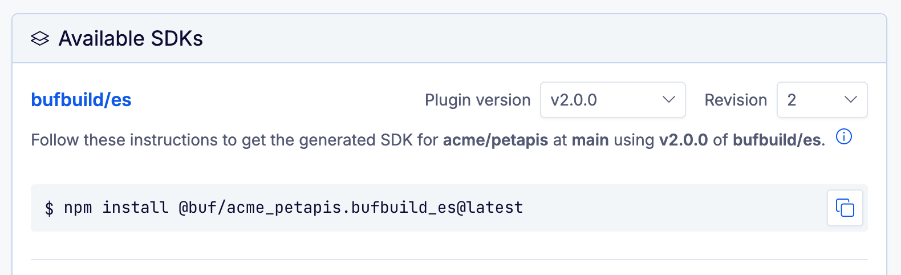

# Manual

<!--
Editing this document:
- To format this file, run the command `npx turbo run format -F //`.
  Dependencies need to be installed first, with `npm ci`.
- For alerts like [!NOTE], insert a blank line between alert and text.
- Always use reference-style links.
--->

## What is Protocol Buffers?

Protocol Buffers (aka Protobuf) is an [interface definition language][wikipedia.org/idl] and binary serialization
format. Schemas defined in `.proto` files are platform-independent and can be used in many languages.

For example, the following Protobuf file ([example.proto]) defines a data structure named `User`:

```protobuf
syntax = "proto3";
package example;

message User {
  string first_name = 1;
  string last_name = 2;
  bool active = 3;
  User manager = 4;
  repeated string locations = 5;
  map<string, string> projects = 6;
}
```

To use the data structure, you generate code with a Protobuf compiler and a plugin for the language of your choice.
To learn more about Protobuf's capabilities, read the [official language guide][protobuf.dev].

## What is Protobuf-ES?

Protobuf-ES is a complete implementation of Protocol Buffers in TypeScript, suitable for web browsers, Node.js, and Deno,
created by [Buf]. It's the only fully-compliant JavaScript Protobuf library that passes the Protobuf conformance
tests—[read more on our blog][blog-post].

Protobuf-ES consists of three npm packages:

- [@bufbuild/protoc-gen-es]: Compiler plugin to generate TypeScript or JavaScript.
- [@bufbuild/protobuf]: Runtime library with core functionality.
- [@bufbuild/protoplugin]: Helps to create your own code generator.

## How to generate code

The quickstart below shows a simple example of code generation for a `.proto` file.

1.  Start with a new project:

    ```shellsession
    mkdir example
    cd example
    npm init -y
    npm install typescript
    npx tsc --init
    ```

2.  Install the runtime library, code generator, and the [Buf CLI][buf-cli]:

    ```shellsession
    npm install @bufbuild/protobuf
    npm install --save-dev @bufbuild/buf @bufbuild/protoc-gen-es
    ```

3.  Create a `buf.gen.yaml` file that looks like this:

    ```yaml
    # Learn more: https://buf.build/docs/configuration/v2/buf-gen-yaml
    version: v2
    inputs:
      - directory: proto
    plugins:
      - local: protoc-gen-es
        out: src/gen
        opt: target=ts
    ```

4.  Create a `proto` subdirectory and download [example.proto] into it.

5.  To generate code for all Protobuf files in the `proto` directory, simply run:

    ```shellsession
    npx buf generate
    ```

The generated code now exists in `src/gen/example_pb.ts`:

```diff
  .
  ├── buf.gen.yaml
  ├── package.json
  ├── proto
  │   └── example.proto
  └── src
      └── gen
+         └── example_pb.ts
```

### Generate with `protoc`

`protoc-gen-es` is a standard Protobuf plugin, and can also be used with [`protoc`][gh-protoc]:

```shellsession
PATH=$PATH:$(pwd)/node_modules/.bin \
    protoc -I . \
    --es_out src/gen \
    --es_opt target=ts \
    proto/example.proto
```

Note that `node_modules/.bin` needs to be added to the `$PATH` so that the Protobuf compiler can find the plugin. This
happens automatically with npm scripts.

If you use Yarn, versions v2 and above don't use a `node_modules` directory, so you need to change the variable a
bit:

```shellsession
PATH=$(dirname $(yarn bin protoc-gen-es)):$PATH
```

</details>

## Plugin options

Our plugin supports a few options to control the generated code. The example above used `target=ts` to generate
TypeScript files.

With [@bufbuild/buf], multiple options can be specified as a YAML list:

```yaml
# buf.gen.yaml
version: v2
plugins:
  - local: protoc-gen-es
    out: src/gen
    opt: # multiple options
      - target=ts
      - import_extension=js
```

With [`protoc`][gh-protoc], you specify multiple options with multiple `--es_opt` flags. Alternatively, both compilers
allow you to specify multiple options as a single comma-separated value like `target=ts,import_extension=js`.

### `target`

This option controls whether the plugin generates JavaScript, TypeScript, or TypeScript declaration files. Possible
values:

- `target=js`: Generates a `_pb.js` file for every `.proto` input file.
- `target=ts`: Generates a `_pb.ts` file for every `.proto` input file.
- `target=dts`: Generates a `_pb.d.ts` file for every `.proto` input file.

You can pass multiple values by separating them with `+`—for example, `target=js+dts`.

By default, it generates JavaScript and TypeScript declaration files, which produces the smallest code size and is the
most compatible with various bundler configurations. If you prefer to generate TypeScript, use `target=ts`.

### `import_extension`

By default, [protoc-gen-es][@bufbuild/protoc-gen-es] doesn't add file extensions to import paths. However, some
environments require an import extension. For example, using [ECMAScript modules in Node.js][ecmascript-modules]
requires the `.js` extension, and Deno requires `.ts`. With this plugin option, you can add `.js`/`.ts` extensions in
import paths with the given value. Possible values:

- `import_extension=none`: Doesn't add an extension. (Default)
- `import_extension=js`: Adds the `.js` extension.
- `import_extension=ts`. Adds the `.ts` extension.

### `js_import_style`

By default, [protoc-gen-es] generates ECMAScript `import` and `export` statements. For use cases where CommonJS is
difficult to avoid, this option can be used to generate CommonJS `require()` calls. Possible values:

- `js_import_style=module`: Generates ECMAScript `import`/`export` statements. (Default)
- `js_import_style=legacy_commonjs`: Generates CommonJS `require()` calls.

### `keep_empty_files=true`

By default, [protoc-gen-es] omits empty files from the plugin output. This option disables pruning of empty files to
allow for smooth interoperation with Bazel and similar tooling that requires all output files to be declared ahead of
time. Unless you use Bazel, you probably don't need this option.

### `ts_nocheck=true`

[protoc-gen-es] generates valid TypeScript for current versions of the TypeScript compiler with standard settings.
If you use compiler settings that yield an error for generated code, setting this option generates an annotation at
the top of each file to skip type checks: `// @ts-nocheck`.

### `json_types=true`

Generates JSON types for every Protobuf message and enumeration. Calling `toJson()` automatically returns the JSON type
if available. Learn more about [JSON types](#json-types).

### `valid_types` (experimental)

Generates a Valid type for every Protobuf message. Possible values:

- `valid_types=legacy_required`: Message fields with the `required` label, or the Edition feature
  `features.field_presence=LEGACY_REQUIRED`, are generated as non-optional properties.
- `valid_types=protovalidate_required`: Message fields with protovalidate's [`required` rule](https://buf.build/docs/reference/protovalidate/rules/field_rules/#required)
  are generated as non-optional properties.

You can combine both options with `+`—for example, `valid_types=legacy_required+protovalidate_required`.

Learn more about [Valid types](#valid-types).

## Generated code

This section shows the code that Protobuf-ES generates for each Protobuf definition, based on [example.proto].

### Files

For every Protobuf source file, it generates a corresponding `.js`, `.ts`, or `.d.ts` file, and adds a `_pb` suffix to
the name. For example, for `foo/bar.proto`, it generates `foo/bar_pb.js`.

At the top of each file, it generates a preamble with information about the source file and how it was generated:

```typescript
// @generated by protoc-gen-es v2.0.0 with parameter "target=dts"
// @generated from file example.proto (package example, syntax proto3)
/* eslint-disable */
```

Below the preamble are imports. If your Protobuf file imports another Protobuf file, a relative import is generated:

```typescript
import type { User } from "./example_pb";
```

> [!TIP]
>
> By default, it generates ECMAScript modules, which means we use `import` and `export` statements. To modify imports,
> see the plugin options [`js_import_style`][option-js_import_style] and [`import_extension`][option-import_extension].

Below the import statements, it generates the schema of the Protobuf file:

```typescript
/**
 * Describes the file example.proto.
 */
export declare const file_example: GenFile;
```

You typically only need this export to create a [registry](#registries), or for advanced use cases with reflection.

### Messages

Messages are the primary data structures in Protobuf. They're simple objects with an arbitrary number of fields. For
the following declaration:

```protobuf
message User {
  string first_name = 1;
}
```

Protobuf-ES generates a `User` type:

```typescript
import type { Message } from "@bufbuild/protobuf";

/**
 * @generated from message example.User
 */
export declare type User = Message<"example.User"> & {
  /**
   * @generated from field: string first_name = 1;
   */
  firstName: string;
};
```

and its schema:

```typescript
export declare const UserSchema: GenMessage<User>;
```

If you've used [zod][gh-zod] before, it's similar—you use the schema to parse a message:

```typescript
import { fromBinary } from "@bufbuild/protobuf";
import { UserSchema } from "./gen/example_pb";

const bytes = new Uint8Array([10, 3, 84, 105, 109]);
fromBinary(UserSchema, bytes); // User
```

Schemas are a powerful feature. You can take a deeper dive in the section about [reflection](#reflection).

### Scalar fields

A Protobuf message has an arbitrary number of fields, and fields have one of several available types. Scalar field types
are primitive types, such as a simple string:

```protobuf
string first_name = 1;
```

They're generated as the closest matching type in ECMAScript:

```typescript
/**
 * @generated from field: string first_name = 1;
 */
firstName: string;
```

Here is a complete list of scalar types, and how they map to ECMAScript:

| Protobuf type | ECMAScript type | Notes                                                                           | Default value       |
| ------------- | --------------- | ------------------------------------------------------------------------------- | ------------------- |
| string        | string          | UTF-8                                                                           | `""`                |
| bool          | boolean         |                                                                                 | `false`             |
| bytes         | Uint8Array      |                                                                                 | `new Uint8Array(0)` |
| double        | number          | Double-precision, 64-bit floating point value                                   | `0`                 |
| float         | number          | Single-precision, 32-bit floating point value                                   | `0`                 |
| int32         | number          | 32-bit signed integer with variable length                                      | `0`                 |
| uint32        | number          | 32-bit unsigned integer with variable length                                    | `0`                 |
| int64         | bigint          | 64-bit signed integer with variable length                                      | `0n`                |
| uint64        | bigint          | 64-bit unsigned integer with variable length                                    | `0n`                |
| fixed32       | number          | 32-bit unsigned integer with fixed length (always 4 bytes)                      | `0`                 |
| fixed64       | bigint          | 64-bit unsigned integer with fixed length (always 8 bytes)                      | `0n`                |
| sfixed32      | number          | 32-bit signed integer with fixed length (always 4 bytes)                        | `0`                 |
| sfixed64      | bigint          | 64-bit signed integer with fixed length (always 8 bytes)                        | `0n`                |
| sint32        | number          | 32-bit signed integer with variable length, most efficient for negative numbers | `0`                 |
| sint64        | bigint          | 64-bit signed integer with variable length, most efficient for negative numbers | `0n`                |

Scalar fields use the zero-value as the default.

If `bigint` isn't available in your environment, you can still serialize and deserialize messages with 64-bit integral
fields without losing any data, but the fields hold `string` values instead of `bigint`.

If you prefer that a field use `string` instead of `bigint`, use the field option `jstype = JS_STRING`:

```protobuf
  int64 field = 1 [jstype = JS_STRING]; // will generate `field: string`
```

> [!TIP]
>
> Set `jstype = JS_STRING` on all applicable fields automatically with [buf][buf-cli]. Add the following
> [managed mode][buf.build/managed-mode] config:
>
> ```yaml
> # Add to buf.gen.yaml:
> managed:
>   enabled: true
>   override:
>     - field_option: jstype
>       value: JS_STRING
> ```

### Message fields

For the following Protobuf field declaration:

```protobuf
User manager = 4;
```

Protobuf-ES generates the following property:

```typescript
/**
 * @generated from field: example.User manager = 4;
 */
manager?: User
```

Message fields don't have default values in Protobuf. They are always optional in ECMAScript.

> [!TIP]
>
> [google.protobuf.Struct](#googleprotobufstruct) and the messages from [wrappers.proto](#wrapper-messages-from-googleprotobufwrappersproto)
> have a special representation in generated code.

### Enum fields

For the following Protobuf field declaration that uses an enum type:

```protobuf
PhoneType phone_type = 3;
```

Protobuf-ES generates the following property:

```typescript
/**
 * @generated from field: example.PhoneType phone_type = 3;
 */
phoneType: PhoneType;
```

Enum fields use the first value of the enum as the default. 

### Repeated fields

Repeated fields are represented with an ECMAScript Array. For example, the following Protobuf field declaration:

```protobuf
repeated string locations = 5;
```

is generated as:

```typescript
/**
 * @generated from field: repeated string locations = 5;
 */
locations: string[] = [];
```

Repeated fields have an empty array as the default value.

### Map fields

For the following Protobuf declaration:

```protobuf
map<string, string> projects = 6;
```

Protobuf-ES generates the property:

```typescript
/**
 * @generated from field: map<string, string> projects = 6;
 */
projects: { [key: string]: string } = {};
```

Map fields have an empty object as the default value.

> [!NOTE]
>
> ECMAScript Map objects have great support for key types, but many popular libraries don't support them correctly yet.
> For this reason, we use an object to represent map fields.

### Oneof fields

A `oneof` construct in Protobuf guarantees that only one of the contained fields can be selected at a time.

For the following Protobuf definition:

```protobuf
oneof result {
  int32 number = 1;
  string error = 2;
}
```

Protobuf-ES generates the following property:

```typescript
result:
  | { case: "number";  value: number }
  | { case: "error";   value: string }
  | { case: undefined; value?: undefined } = { case: undefined };
```

The entire `oneof` group is turned into an object `result` with two properties:

- `case`: The name of the selected field
- `value`: The value of the selected field

This property is always defined on the message—similar to the way map or repeated fields are always defined. By default,
it's `{case: undefined}`.

In our example, `result.case` can be either `"number"`, `"error"`, or `undefined`. If a field is selected, the
property `result.value` contains the value of the
selected field.

To select a field, simply replace the `result` object:

```typescript
user.result = { case: "number", value: 123 };
user.result = { case: undefined };
```

To query a `oneof` group, you can use if blocks:

```typescript
if (user.result.case === "number") {
  user.result.value; // a number
}
```

or a switch statement:

```typescript
switch (user.result.case) {
  case "number":
    user.result.value; // a number
    break;
  case "error":
    user.result.value; // a string
    break;
}
```

This representation is particularly useful in TypeScript, because the compiler narrows down the type. The if blocks and
switch statements above tell the compiler the type of the `value` property.

> [!TIP]
>
> This feature requires the TypeScript compiler option `strictNullChecks` to be enabled.
> This option is automatically enabled with the option `strict`. See the [documentation][strictNullChecks] for details.

### Proto2 group fields

Groups are a deprecated language feature of [proto2] that allows you to declare a field and a message at the same time:

```protobuf
optional group MyGroup = 1 {
  optional int32 int32_field = 1;
}
```

For this group field, Protobuf-ES generates the following property and the message `User_MyGroup`:

```ts
/**
 * @generated from field: optional example.User.MyGroup mygroup = 1;
 */
mygroup?: User_MyGroup;
```

> [!CAUTION]
>
> The groups feature is deprecated and shouldn't be used when creating new schemas. Use nested messages instead.

### Proto2 required fields

In proto2, fields can use the `required` keyword to ensure that the field is always set. In Protobuf-ES, required fields
are validated when serializing a message, but not when parsing or constructing a message.

With Protobuf-ES v2, `required` is less of a burden because the properties are no longer optional. However, the
improvement only applies to scalar and enum fields, not to message fields. For message fields, the behavior for
proto2 `required` is unchanged between v1 and v2.

> [!CAUTION]
>
> `required` is a legacy feature. The [official language guide][protobuf.dev/required] states: **Do not use.**

### Proto3 optional fields

In proto3, zero values like `0`, `false`, or `""` aren't serialized by default. 
When the `optional` keyword is added to a field, zero values are serialized. 
The keyword enables presence tracking for a field, allowing you to distinguish between an absent value, and an explicitly set zero value. 

```protobuf
optional bool active = 3;
```

The field is generated as an optional property:

```typescript
/**
 * @generated from field: optional bool active = 3;
 */
active?: boolean;
```

> [!TIP]
>
> See [field presence and default values](#field-presence-and-default-values) for more information about optional
> fields.

### Field names

Property names are always `lowerCamelCase`, even if the corresponding Protobuf field uses
`snake_case`. Though there's no official style for ECMAScript, most style guides ([AirBnB][js-style-guide-airbnb],
[MDN][js-style-guide-mdn], [Google][js-style-guide-google]) as well as [Node.js APIs][js-style-node] and
[browser APIs][js-style-fetch] use `lowerCamelCase`, and so do we.

### Enumerations

For the following Protobuf definition:

```protobuf
enum PhoneType {
  UNSPECIFIED = 0;
  MOBILE = 1;
  LAND_LINE = 2;
}
```

Protobuf-ES generates the following TypeScript enum:

```typescript
/**
 * @generated from enum example.PhoneType
 */
export enum PhoneType {
  UNSPECIFIED = 0,
  MOBILE = 1,
  LAND_LINE = 2,
}
```

If all enum values share a prefix that corresponds with the enum's name, the
prefix is dropped from all enum value names. For example, given the following
enum declaration:

```protobuf
enum PhoneType {
  PHONE_TYPE_UNSPECIFIED = 0;
  PHONE_TYPE_MOBILE = 1;
  PHONE_TYPE_LAND_LINE = 2;
}
```

Protobuf-ES generates the following TypeScript enum:

```typescript
/**
 * @generated from enum example.PhoneType
 */
export enum PhoneType {
  UNSPECIFIED = 0,
  MOBILE = 1,
  LAND_LINE = 2,
}
```

A quick refresher about TypeScript enums:

- You can convert an enum value to a string:
  ```typescript
  let val: PhoneType = PhoneType.MOBILE;
  let name = PhoneType[val]; // => "MOBILE"
  ```
- You can convert a string to an enum value:
  ```typescript
  let val: PhoneType = PhoneType["MOBILE"];
  ```
- TypeScript enums support aliases, as does Protobuf with the `allow_alias` option.

Along with the TypeScript enum, we also generate its schema:

```typescript
/**
 * Describes the enum example.PhoneType.
 */
export declare const PhoneTypeSchema: GenEnum<PhoneType>;
```

To learn more about the schema, take a look at the section about [reflection](#reflection).

> [!WARNING]
>
> Protobuf has [closed and open enums][protobuf.dev/enum]. A closed enum (proto) only accepts declared values, while an
> open enum (proto3) also accepts other values. If you work with open enums, make sure to handle unexpected values.
>
> TypeScript enums are [closed since version 5.0][ts-5.0-enum-overhaul]. Generated code has not been updated to properly
> model open enums with TypeScript v5 and later because Protobuf-ES still supports TypeScript v4.9.5.

### Extensions

An extension is a field defined outside of its container message. For example, we can add the field `age` to the
message `User`:

```protobuf
syntax = "proto2";

message User {
  extensions 100 to 200;
}

// The extension can also be defined in a separate file
extend User {
  optional uint32 age = 100;
}
```

Given that extension, Protobuf-ES generates the export:

```typescript
/**
 * @generated from extension: optional uint32 age = 100;
 */
export declare const age: GenExtension<User, number>;
```

You can set the `age` extension field like this:

```ts
import { setExtension } from "@bufbuild/protobuf";
import { User, age } from "./example_pb.js";

const user = new User();
setExtension(user, age, 77);
```

If the message already has a value for the `age` extension, the value is replaced.
You can remove an extension from a message with the function `clearExtension`.
To retrieve an extension value, use `getExtension`. To check whether an extension
is set, use `hasExtension`.

```ts
import {
  setExtension,
  getExtension,
  hasExtension,
  clearExtension,
} from "@bufbuild/protobuf";

setExtension(user, age, 77);
hasExtension(user, age); // true
getExtension(user, age); // 77
clearExtension(user, age);
hasExtension(user, age); // false
```

Note that `getExtension` never returns `undefined`. If the extension isn't set, `hasExtension` returns `false`, but
`getExtension` returns the default value, for example:

- `0` for numeric types
- `[]` for repeated fields
- an empty message instance for message fields

Extensions are stored as [unknown fields](#unknown-fields) on a message. If you retrieve an extension value, it's
deserialized from the binary unknown field data. To mutate a value, make sure to store the new value with `setExtension`
after mutating. For example, let's say you have the extension field `repeated string hobbies = 101`, and want to add
values:

```ts
import {
  setExtension,
  getExtension,
  hasExtension,
  clearExtension,
} from "@bufbuild/protobuf";
import { hobbies } from "./example_pb.js";

const h = getExtension(user, hobbies);
h.push("Baking");
h.push("Pottery");

setExtension(user, hobbies, h);
```

> [!NOTE]
>
> In proto3, extensions can only be used for [custom options](#custom-options).

> [!TIP]
>
> To use extensions with the JSON format, you need to provide them in the [serialization options](#json-serialization-options).

### Services

In Protobuf, you can define a service for Remote Procedure Calls (RPCs):

```protobuf
service UserService {
  rpc CreateUser(CreateUserRequest) returns (CreateUserResponse);
}
```

For every service, Protobuf-ES generates just the schema that describes the service and its methods:

```typescript
/**
 * @generated from service example.UserService
 */
export declare const UserService: GenService<{
  /**
   * @generated from rpc example.UserService.CreateUser
   */
  createUser: {
    methodKind: "unary";
    input: typeof CreateUserRequestSchema;
    output: typeof CreateUserResponseSchema;
  };
}>;
```

Protobuf-ES doesn't implement RPC itself, but other projects can use this typed schema. See
[Connect-ES][gh-connect-es] for a project that does.

### Reserved names

Some names that are valid in Protobuf can't be used in ECMAScript, either because they are reserved keywords like
`catch`, or because they would clash with built-in properties like `constructor`. [@bufbuild/protoc-gen-es]
escapes reserved names by adding the suffix `$`.

### Names for nested types

Message and enum declarations can be nested in a message. For example:

```protobuf
syntax = "proto3";
package example;

message User {
  string first_name = 1;
  Type type = 7;

  enum Type {
    USER = 0;
    MANAGER = 1;
  }
}
```

Similar to Protobuf in Go, we join the name of a nested type with its parents' names, separated with an underscore.
In generated code, the enum `User.Type` has the identifier `User_Type`.

### Comments

We believe that comments in Protobuf source files are important, and take great care to carry them over to the
generated code as JSDocs comments. That includes license headers in your file, but also comments on messages, fields,
services and methods.

If you deprecate a Protobuf element, we add a JSDoc tag to the generated element:

```typescript
/**
 * This field is deprecated
 *
 * @generated from field: string deprecated_field = 1 [deprecated = true];
 * @deprecated
 */
deprecatedField = "";
```

### Packages

Protobuf files can specify a package for languages that support namespaces, like Java. ECMAScript does not have an
equivalent, so Protobuf packages are largely ignored, but are supported in [descriptors](#descriptors) and type names.

## Well-known types

Protobuf has a small standard library of well-known types. [@bufbuild/protobuf] provides all of
them as pre-compiled exports. If you import a well-known type in a Protobuf file, the generated code simply imports from
`@bufbuild/protobuf/wkt`.

<details><summary>Expand to see the list of Well-known types</summary>

| Protobuf file                                                                                                                                                                                                                              | Well-known types                                                                                                                                                                                                                                                                                                                                                                                                                                                                                                                                                                                                                                                                                                                                                                                                                                                                                                                                                                                                                                                                                                                                                                                                                                                                                                                                                                                                                                                                                                                                                                                                                                                                                                                                                                                                                                                                                                                                                                                                                                                                                                                                                                                                                                                                                                                                                                                                                                                                                                                                                                                                                                                                                                                                                                                                                                                                                                                                                                                                                                                                                                                                                                                                                                                                                                                                                                                                                                                                                                |
| ------------------------------------------------------------------------------------------------------------------------------------------------------------------------------------------------------------------------------------------ | --------------------------------------------------------------------------------------------------------------------------------------------------------------------------------------------------------------------------------------------------------------------------------------------------------------------------------------------------------------------------------------------------------------------------------------------------------------------------------------------------------------------------------------------------------------------------------------------------------------------------------------------------------------------------------------------------------------------------------------------------------------------------------------------------------------------------------------------------------------------------------------------------------------------------------------------------------------------------------------------------------------------------------------------------------------------------------------------------------------------------------------------------------------------------------------------------------------------------------------------------------------------------------------------------------------------------------------------------------------------------------------------------------------------------------------------------------------------------------------------------------------------------------------------------------------------------------------------------------------------------------------------------------------------------------------------------------------------------------------------------------------------------------------------------------------------------------------------------------------------------------------------------------------------------------------------------------------------------------------------------------------------------------------------------------------------------------------------------------------------------------------------------------------------------------------------------------------------------------------------------------------------------------------------------------------------------------------------------------------------------------------------------------------------------------------------------------------------------------------------------------------------------------------------------------------------------------------------------------------------------------------------------------------------------------------------------------------------------------------------------------------------------------------------------------------------------------------------------------------------------------------------------------------------------------------------------------------------------------------------------------------------------------------------------------------------------------------------------------------------------------------------------------------------------------------------------------------------------------------------------------------------------------------------------------------------------------------------------------------------------------------------------------------------------------------------------------------------------------------------------------------- |
| [google/protobuf/any.proto]<br>                                                                                                                                                                                                            | message [Any][src/wkt/Any]<br>                                                                                                                                                                                                                                                                                                                                                                                                                                                                                                                                                                                                                                                                                                                                                                                                                                                                                                                                                                                                                                                                                                                                                                                                                                                                                                                                                                                                                                                                                                                                                                                                                                                                                                                                                                                                                                                                                                                                                                                                                                                                                                                                                                                                                                                                                                                                                                                                                                                                                                                                                                                                                                                                                                                                                                                                                                                                                                                                                                                                                                                                                                                                                                                                                                                                                                                                                                                                                                                                                  |
| [google/protobuf/duration.proto]<br>                                                                                                                                                                                                       | message [Duration][src/wkt/Duration]<br>                                                                                                                                                                                                                                                                                                                                                                                                                                                                                                                                                                                                                                                                                                                                                                                                                                                                                                                                                                                                                                                                                                                                                                                                                                                                                                                                                                                                                                                                                                                                                                                                                                                                                                                                                                                                                                                                                                                                                                                                                                                                                                                                                                                                                                                                                                                                                                                                                                                                                                                                                                                                                                                                                                                                                                                                                                                                                                                                                                                                                                                                                                                                                                                                                                                                                                                                                                                                                                                                        |
| [google/protobuf/timestamp.proto]<br>                                                                                                                                                                                                      | message [Timestamp][src/wkt/Timestamp]<br>                                                                                                                                                                                                                                                                                                                                                                                                                                                                                                                                                                                                                                                                                                                                                                                                                                                                                                                                                                                                                                                                                                                                                                                                                                                                                                                                                                                                                                                                                                                                                                                                                                                                                                                                                                                                                                                                                                                                                                                                                                                                                                                                                                                                                                                                                                                                                                                                                                                                                                                                                                                                                                                                                                                                                                                                                                                                                                                                                                                                                                                                                                                                                                                                                                                                                                                                                                                                                                                                      |
| [google/protobuf/wrappers.proto]<br><br><br><br><br><br><br><br><br>                                                                                                                                                                       | message [DoubleValue][src/wkt/DoubleValue]<br>message [FloatValue][src/wkt/FloatValue]<br>message [Int64Value][src/wkt/Int64Value]<br>message [UInt64Value][src/wkt/UInt64Value]<br>message [Int32Value][src/wkt/Int32Value]<br>message [UInt32Value][src/wkt/UInt32Value]<br>message [BoolValue][src/wkt/BoolValue]<br>message [StringValue][src/wkt/StringValue]<br>message [BytesValue][src/wkt/BytesValue]<br>                                                                                                                                                                                                                                                                                                                                                                                                                                                                                                                                                                                                                                                                                                                                                                                                                                                                                                                                                                                                                                                                                                                                                                                                                                                                                                                                                                                                                                                                                                                                                                                                                                                                                                                                                                                                                                                                                                                                                                                                                                                                                                                                                                                                                                                                                                                                                                                                                                                                                                                                                                                                                                                                                                                                                                                                                                                                                                                                                                                                                                                                                              |
| [google/protobuf/struct.proto]<br><br><br><br>                                                                                                                                                                                             | message [Struct][src/wkt/Struct]<br>message [Value][src/wkt/Value]<br>message [ListValue][src/wkt/ListValue]<br>enum [NullValue][src/wkt/NullValue]<br>                                                                                                                                                                                                                                                                                                                                                                                                                                                                                                                                                                                                                                                                                                                                                                                                                                                                                                                                                                                                                                                                                                                                                                                                                                                                                                                                                                                                                                                                                                                                                                                                                                                                                                                                                                                                                                                                                                                                                                                                                                                                                                                                                                                                                                                                                                                                                                                                                                                                                                                                                                                                                                                                                                                                                                                                                                                                                                                                                                                                                                                                                                                                                                                                                                                                                                                                                         |
| [google/protobuf/field_mask.proto]<br>                                                                                                                                                                                                     | message [FieldMask][src/wkt/FieldMask]<br>                                                                                                                                                                                                                                                                                                                                                                                                                                                                                                                                                                                                                                                                                                                                                                                                                                                                                                                                                                                                                                                                                                                                                                                                                                                                                                                                                                                                                                                                                                                                                                                                                                                                                                                                                                                                                                                                                                                                                                                                                                                                                                                                                                                                                                                                                                                                                                                                                                                                                                                                                                                                                                                                                                                                                                                                                                                                                                                                                                                                                                                                                                                                                                                                                                                                                                                                                                                                                                                                      |
| [google/protobuf/empty.proto]<br>                                                                                                                                                                                                          | message [Empty][src/wkt/Empty]<br>                                                                                                                                                                                                                                                                                                                                                                                                                                                                                                                                                                                                                                                                                                                                                                                                                                                                                                                                                                                                                                                                                                                                                                                                                                                                                                                                                                                                                                                                                                                                                                                                                                                                                                                                                                                                                                                                                                                                                                                                                                                                                                                                                                                                                                                                                                                                                                                                                                                                                                                                                                                                                                                                                                                                                                                                                                                                                                                                                                                                                                                                                                                                                                                                                                                                                                                                                                                                                                                                              |
| [google/protobuf/api.proto]<br><br><br>                                                                                                                                                                                                    | message [Api][src/wkt/Api]<br>message [Method][src/wkt/Method]<br>message [Mixin][src/wkt/Mixin]<br>                                                                                                                                                                                                                                                                                                                                                                                                                                                                                                                                                                                                                                                                                                                                                                                                                                                                                                                                                                                                                                                                                                                                                                                                                                                                                                                                                                                                                                                                                                                                                                                                                                                                                                                                                                                                                                                                                                                                                                                                                                                                                                                                                                                                                                                                                                                                                                                                                                                                                                                                                                                                                                                                                                                                                                                                                                                                                                                                                                                                                                                                                                                                                                                                                                                                                                                                                                                                            |
| [google/protobuf/type.proto]<br><br><br><br><br><br><br><br>                                                                                                                                                                               | message [Type][src/wkt/Type]<br>message [Field][src/wkt/Field]<br>enum [Field_Kind][src/wkt/Field_Kind]<br>enum [Field_Cardinality][src/wkt/Field_Cardinality]<br>message [Enum][src/wkt/Enum]<br>message [EnumValue][src/wkt/EnumValue]<br>message [Option][src/wkt/Option]<br>enum [Syntax][src/wkt/Syntax]<br>                                                                                                                                                                                                                                                                                                                                                                                                                                                                                                                                                                                                                                                                                                                                                                                                                                                                                                                                                                                                                                                                                                                                                                                                                                                                                                                                                                                                                                                                                                                                                                                                                                                                                                                                                                                                                                                                                                                                                                                                                                                                                                                                                                                                                                                                                                                                                                                                                                                                                                                                                                                                                                                                                                                                                                                                                                                                                                                                                                                                                                                                                                                                                                                               |
| [google/protobuf/source_context.proto]<br>                                                                                                                                                                                                 | message [SourceContext][src/wkt/SourceContext]<br>                                                                                                                                                                                                                                                                                                                                                                                                                                                                                                                                                                                                                                                                                                                                                                                                                                                                                                                                                                                                                                                                                                                                                                                                                                                                                                                                                                                                                                                                                                                                                                                                                                                                                                                                                                                                                                                                                                                                                                                                                                                                                                                                                                                                                                                                                                                                                                                                                                                                                                                                                                                                                                                                                                                                                                                                                                                                                                                                                                                                                                                                                                                                                                                                                                                                                                                                                                                                                                                              |
| [google/protobuf/descriptor.proto]<br><br><br><br><br><br><br><br><br><br><br><br><br><br><br><br><br><br><br><br><br><br><br><br><br><br><br><br><br><br><br><br><br><br><br><br><br><br><br><br><br><br><br><br><br><br><br><br><br><br> | message [FileDescriptorSet][src/wkt/FileDescriptorSet]<br>message [FileDescriptorProto][src/wkt/FileDescriptorProto]<br>message [DescriptorProto][src/wkt/DescriptorProto]<br>message [DescriptorProto_ExtensionRange][src/wkt/DescriptorProto_ExtensionRange]<br>message [DescriptorProto_ReservedRange][src/wkt/DescriptorProto_ReservedRange]<br>message [ExtensionRangeOptions][src/wkt/ExtensionRangeOptions]<br>message [ExtensionRangeOptions_Declaration][src/wkt/ExtensionRangeOptions_Declaration]<br>enum [ExtensionRangeOptions_VerificationState][src/wkt/ExtensionRangeOptions_VerificationState]<br>message [FieldDescriptorProto][src/wkt/FieldDescriptorProto]<br>enum [FieldDescriptorProto_Type][src/wkt/FieldDescriptorProto_Type]<br>enum [FieldDescriptorProto_Label][src/wkt/FieldDescriptorProto_Label]<br>message [OneofDescriptorProto][src/wkt/OneofDescriptorProto]<br>message [EnumDescriptorProto][src/wkt/EnumDescriptorProto]<br>message [EnumDescriptorProto_EnumReservedRange][src/wkt/EnumDescriptorProto_EnumReservedRange]<br>message [EnumValueDescriptorProto][src/wkt/EnumValueDescriptorProto]<br>message [ServiceDescriptorProto][src/wkt/ServiceDescriptorProto]<br>message [MethodDescriptorProto][src/wkt/MethodDescriptorProto]<br>message [FileOptions][src/wkt/FileOptions]<br>enum [FileOptions_OptimizeMode][src/wkt/FileOptions_OptimizeMode]<br>message [MessageOptions][src/wkt/MessageOptions]<br>message [FieldOptions][src/wkt/FieldOptions]<br>message [FieldOptions_EditionDefault][src/wkt/FieldOptions_EditionDefault]<br>message [FieldOptions_FeatureSupport][src/wkt/FieldOptions_FeatureSupport]<br>enum [FieldOptions_CType][src/wkt/FieldOptions_CType]<br>enum [FieldOptions_JSType][src/wkt/FieldOptions_JSType]<br>enum [FieldOptions_OptionRetention][src/wkt/FieldOptions_OptionRetention]<br>enum [FieldOptions_OptionTargetType][src/wkt/FieldOptions_OptionTargetType]<br>message [OneofOptions][src/wkt/OneofOptions]<br>message [EnumOptions][src/wkt/EnumOptions]<br>message [EnumValueOptions][src/wkt/EnumValueOptions]<br>message [ServiceOptions][src/wkt/ServiceOptions]<br>message [MethodOptions][src/wkt/MethodOptions]<br>enum [MethodOptions_IdempotencyLevel][src/wkt/MethodOptions_IdempotencyLevel]<br>message [UninterpretedOption][src/wkt/UninterpretedOption]<br>message [UninterpretedOption_NamePart][src/wkt/UninterpretedOption_NamePart]<br>message [FeatureSet][src/wkt/FeatureSet]<br>enum [FeatureSet_FieldPresence][src/wkt/FeatureSet_FieldPresence]<br>enum [FeatureSet_EnumType][src/wkt/FeatureSet_EnumType]<br>enum [FeatureSet_RepeatedFieldEncoding][src/wkt/FeatureSet_RepeatedFieldEncoding]<br>enum [FeatureSet_Utf8Validation][src/wkt/FeatureSet_Utf8Validation]<br>enum [FeatureSet_MessageEncoding][src/wkt/FeatureSet_MessageEncoding]<br>enum [FeatureSet_JsonFormat][src/wkt/FeatureSet_JsonFormat]<br>message [FeatureSetDefaults][src/wkt/FeatureSetDefaults]<br>message [FeatureSetDefaults_FeatureSetEditionDefault][src/wkt/FeatureSetDefaults_FeatureSetEditionDefault]<br>message [SourceCodeInfo][src/wkt/SourceCodeInfo]<br>message [SourceCodeInfo_Location][src/wkt/SourceCodeInfo_Location]<br>message [GeneratedCodeInfo][src/wkt/GeneratedCodeInfo]<br>message [GeneratedCodeInfo_Annotation][src/wkt/GeneratedCodeInfo_Annotation]<br>enum [GeneratedCodeInfo_Annotation_Semantic][src/wkt/GeneratedCodeInfo_Annotation_Semantic]<br>enum [Edition][src/wkt/Edition]<br> |
| [google/protobuf/compiler/plugin.proto]<br><br><br><br><br>                                                                                                                                                                                | message [Version][src/wkt/Version]<br>message [CodeGeneratorRequest][src/wkt/CodeGeneratorRequest]<br>message [CodeGeneratorResponse][src/wkt/CodeGeneratorResponse]<br>message [CodeGeneratorResponse_File][src/wkt/CodeGeneratorResponse_File]<br>enum [CodeGeneratorResponse_Feature][src/wkt/CodeGeneratorResponse_Feature]<br>                                                                                                                                                                                                                                                                                                                                                                                                                                                                                                                                                                                                                                                                                                                                                                                                                                                                                                                                                                                                                                                                                                                                                                                                                                                                                                                                                                                                                                                                                                                                                                                                                                                                                                                                                                                                                                                                                                                                                                                                                                                                                                                                                                                                                                                                                                                                                                                                                                                                                                                                                                                                                                                                                                                                                                                                                                                                                                                                                                                                                                                                                                                                                                             |

</details>

For some of the well-known types, we provide additional features for convenience:

### google.protobuf.Timestamp

A `Timestamp` represents a point in time with nanosecond precision. It's independent of any time zone or local
calendar. For convenience, we provide a few functions for conversion:

```typescript
import {
  type Timestamp,
  timestampNow,
  timestampFromDate,
  timestampFromMs,
  timestampDate,
  timestampMs,
} from "@bufbuild/protobuf/wkt";

// Create a Timestamp for the current time.
let ts: Timestamp = timestampNow();

// Create a Timestamp message from an ECMAScript Date.
ts = timestampFromDate(new Date(1938, 0, 10));

// Create a Timestamp message from a Unix timestamp in milliseconds.
ts = timestampFromMs(818035920123);

// Convert a Timestamp message to an ECMAScript Date.
let date: Date = timestampDate(ts);

// Convert a Timestamp to a Unix timestamp in milliseconds.
let ms: number = timestampMs(ts);
```

### google.protobuf.Any

`Any` stores an arbitrary message as binary data. For convenience, we provide function to pack and unpack messages:

```typescript
import { type Any, anyPack, anyIs } from "@bufbuild/protobuf/wkt";
import { create, createRegistry } from "@bufbuild/protobuf";
import { type User, UserSchema } from "./gen/example_pb";

let user: User = create(UserSchema);

// Create a new Any, and pack the given message into it
let any: Any = anyPack(UserSchema, user);

// Check if the Any contains a specific type
anyIs(any, UserSchema); // true
anyIs(any, "example.User"); // true

// Try to unpack a specific message from an Any
anyUnpack(any, UserSchema); // User | undefined

// Unpack an any, using a registry of known types
const registry = createRegistry(UserSchema);
anyUnpack(any, registry); // Message | undefined
```

### google.protobuf.Struct

`Struct` stores a dynamic object with the same range of types as a plain object in JSON. When this message is used in a
field, it's generated as the type `JsonObject` from [@bufbuild/protobuf]. For example:

```typescript
/**
 * @generated from field: google.protobuf.Struct struct = 1;
 */
struct?: JsonObject;
```

This feature makes it very easy to work with `Struct` fields:

```typescript
myMessage.struct = {
  text: "abc",
  number: 123,
};
```

### Wrapper messages from google/protobuf/wrappers.proto

[wrappers.proto][google/protobuf/wrappers.proto] defines a message for every Protobuf primitive type. The messages are
useful for embedding primitives in the `google.protobuf.Any` type, or to distinguish between the absence of a primitive
field and its default value.

For convenience, it generates fields that use one of the wrapper messages as "unboxed" optional primitives:

```typescript
/**
 * @generated from field: google.protobuf.BoolValue bool_value_field = 1;
 */
boolValueField?: boolean;
```

## Working with messages

### Constructing a message

You create a message with the function `create`, and a message schema:

```typescript
import { create } from "@bufbuild/protobuf";
import { type User, UserSchema } from "./gen/example_pb";

const user: User = create(UserSchema);
```

For convenience, the function accepts an initializer object. All fields in the initializer object are optional, and if
not provided, the default value for the field is used:

```typescript
import { create } from "@bufbuild/protobuf";
import { type User, UserSchema } from "./gen/example_pb";

const user: User = create(UserSchema, {
  firstName: "Homer",
  active: true,
  manager: {
    // Manager is also a message. You can pass an initializer object here,
    // and don't need create().
    lastName: "Burns",
  },
});
```

### Serializing messages

Messages can be serialized with the binary or the JSON format. The [conformance test suite][gh-buf-conformance] ensures
interoperability with implementations in other languages.

To serialize a message, call the function `toBinary` with the schema and the message. To parse a message, use
`fromBinary`:

```typescript
import { toBinary, fromBinary } from "@bufbuild/protobuf";
import { type User, UserSchema } from "./gen/example_pb";

declare let user: User;

const bytes: Uint8Array = toBinary(UserSchema, user);
user = fromBinary(UserSchema, bytes);
```

JSON serialization follows the [ProtoJSON][protobuf.dev/protojson] format. Use it with the functions `toJson` and `fromJson`:

```typescript
import { toJson, fromJson, type JsonValue } from "@bufbuild/protobuf";
import { type User, UserSchema } from "./gen/example_pb";

declare let user: User;

const json: JsonValue = toJson(UserSchema, user);
user = fromJson(UserSchema, json);
```

`JsonValue` can be serialized to a `string` with `JSON.stringify`. For convenience, we also provide the functions
`toJsonString` and `fromJsonString` that include the step.

To parse into an existing message, use the functions `mergeFromBinary` and `mergeFromJson`. To learn about serialization
options and other details, see the [serialization section](#serialization).

### Identifying messages

The function `isMessage` is a type guard to check whether a value is a specific message.

```typescript
import { create, isMessage } from "@bufbuild/protobuf";
import { UserSchema } from "./gen/example_pb";

const msg: unknown = create(UserSchema);

msg.firstName; // type error

if (isMessage(msg, UserSchema)) {
  msg.firstName; // string
}
```

Messages include their fully qualified name in the `$typeName` property:

```typescript
msg.$typeName; // "example.User"
```

> [!TIP]
>
> If you don't know the message's schema, you can look it up in a [registry](#registries).

### Field presence and default values

In general, all fields in Protobuf are optional. The rationale is that optional fields allow the schema to evolve, and
that applications are more robust if they handle missing fields gracefully. To avoid boilerplate, Protobuf
implementations typically implement default values.

For example, if you create a new `User` message, the boolean field `active` has the default value `false`.
The value `false` is never serialized, so it is important to design the schema accordingly.

Protobuf can distinguish between a default value `false` and a property deliberately set to `false` with explicit field
presence. In proto3, you can use the `optional` keyword to enable explicit presence for a field:

```protobuf
syntax = "proto3";

message Presence {
  // Implicit presence - false is not serialized.
  bool a = 1;
  // Explicit presence - false is serialized.
  optional bool b = 2;
}
```

With Protobuf-ES, you can determine whether a field is present with the function `isFieldSet`. In the following example,
the field with implicit presence always ignores `false`, while the field with explicit presence tracks that the field
has been set:

```typescript
import { isFieldSet } from "@bufbuild/protobuf";
import { PresenceSchema } from "./gen/example_pb";

const msg = create(PresenceSchema);
isFieldSet(msg, PresenceSchema.field.a); // false
isFieldSet(msg, PresenceSchema.field.b); // false

msg.a = false;
msg.b = false;
isFieldSet(msg, PresenceSchema.field.a); // false
isFieldSet(msg, PresenceSchema.field.b); // true
```

For repeated fields, `isFieldSet` returns true if the Array has one or more elements. For map fields, `isFieldSet`
returns true if the Object has one or more entries. `clearField` resets a field.

> [!IMPORTANT]
>
> Protobuf-ES uses the prototype chain to track explicit presence for fields with default values.
>
> - With proto3, your messages will always be plain objects without a custom prototype.
> - With proto2, your messages will always use a custom prototype for default values.
> - With editions, your messages will use a custom prototype, unless all scalar and enum fields use `features.field_presence=IMPLICIT`.

### Comparing messages

Use the function `equals` to check whether two messages of the same schema have the same field values:

```typescript
import { equals } from "@bufbuild/protobuf";
import { type User, UserSchema } from "./gen/example_pb";

declare const a: User;
declare const b: User;

equals(UserSchema, a, b); // boolean
```

> [!NOTE]
>
> NaN does not equal NaN.

> [!IMPORTANT]
>
> [Extensions](#extensions) and [unknown fields](#unknown-fields) are disregarded by `equals()`.

### Cloning messages

Use the function `clone` to create a deep copy of a message:

```typescript
import { clone } from "@bufbuild/protobuf";
import { type User, UserSchema } from "./gen/example_pb";

declare const a: User;

const b = clone(UserSchema, a);
```

> [!NOTE]
>
> `clone()` clones [extensions](#extensions) and [unknown fields](#unknown-fields).

## Serialization

As a general guide when deciding between the binary format and JSON, the JSON format is great for debugging, but the binary
format is more resilient to changes. For example, you can rename a field and still parse binary data serialized with
the previous version. In general, the binary format is also more performant than JSON. JSON serialization follows the [ProtoJSON][protobuf.dev/protojson] format.

### Binary serialization options

Options for `toBinary`:

- `writeUnknownFields?: boolean`<br/>
  Controls whether to include [unknown fields](#unknown-fields) in the serialized output. The default behavior
  is to retain unknown fields and include them in the serialized output.

Options for `fromBinary`:

- `readUnknownFields?: boolean`<br/>
  Controls whether to retain [unknown fields](#unknown-fields) during parsing. The default behavior is to retain
  unknown fields and include them in the serialized output.

### JSON serialization options

Options for `fromJson` and `fromJsonString`:

- `ignoreUnknownFields?: boolean`<br/>
  By default, unknown properties are rejected. This option overrides that behavior and ignores properties, as well as
  unrecognized enum string representations.
- `registry?: Registry`<br/>
  A [registry](#registries) to use for parsing [`google.protobuf.Any`](#googleprotobufany) and [extensions](#extensions)
  from JSON.

Options for `toJson` and `toJsonString`:

- `alwaysEmitImplicit?: boolean`<br/>
  By default, fields with implicit presence are not serialized if they are
  unset. For example, an empty list field or a proto3 int32 field with `0` is
  not serialized. With this option enabled, such fields are included in the
  output.
- `enumAsInteger?: boolean`<br/>
  The name of an enum value is used by default in JSON output. This option
  overrides the behavior to use the numeric value of the enum value instead.
- `useProtoFieldName?: boolean`<br/>
  Field names are converted to lowerCamelCase by default in JSON output. This
  option overrides the behavior to use the proto field name instead.
- `registry?: Registry`<br/>
  A [registry](#registries) to use for converting [extensions](#extensions) and
  [`google.protobuf.Any`](#googleprotobufany) to JSON.
- `prettySpaces?: number`<br/>
  Only available with `toJsonString`. A convenience property for the `space` parameter to
  [JSON.stringify][JSON.stringify parameters].

### Unknown fields

When binary message data is parsed, unrecognized fields are stored on the message as unknown fields in the property
`$unknown?: UnknownField[]`. When the message is serialized, unknown fields are included, preserving them.

This default behavior can be modified with the [binary serialization options](#binary-serialization-options)
`readUnknownFields` and `writeUnknownFields`.

[Extension](#extensions) values are also stored as unknown fields.

### Binary encoding

At a low level, the Protobuf binary serialization is implemented with the classes `BinaryReader` and `BinaryWriter`.
They implement the primitives of the [Protobuf binary encoding][protobuf.dev/encoding].

Both classes are part of the public API and can be used on their own. The following example uses `BinaryWriter` to
serialize data for our example message:

```ts
import { BinaryWriter, WireType } from "@bufbuild/protobuf/wire";
import { UserSchema } from "./gen/example_pb";

const bytes = new BinaryWriter()
  // string first_name = 1
  .tag(1, WireType.LengthDelimited)
  .string("Homer")
  // bool active = 3
  .tag(3, WireType.Varint)
  .bool(true)
  .finish();

const user = fromBinary(UserSchema, bytes);
user.firstName; // "Homer"
user.active; // true
```

### Text encoding

We require the WHATWG [Text Encoding API] to convert UTF-8 from and to binary. The API is widely available, but it is
not part of the ECMAScript standard.

If the API is unavailable in your runtime, use the function `configureTextEncoding` from `@bufbuild/protobuf/wire` to
provide your own implementation. Note that the function must be called early in the initialization.

### Base64 encoding

Base64 encoding can be very useful when transmitting binary data. There is no convenient standard API in ECMAScript, but
we export two functions for encoding and decoding:

```typescript
import { base64Encode, base64Decode } from "@bufbuild/protobuf/wire";

base64Encode(new Uint8Array([2, 4, 8, 16])); // "AgQIEA=="
base64Decode("AgQIEA=="); // Uint8Array(4) [ 2, 4, 8, 16 ]
```

### Size-delimited message streams

Protobuf-ES supports the size-delimited format for messages. It lets you serialize multiple messages to a stream and
parse multiple messages from a stream. A size-delimited message is a varint size in bytes, followed by exactly that many
bytes of a message serialized with the binary format. This implementation is compatible with its counterparts in
[C++][protodelim-c++], [Java][protodelim-java], [Go][protodelim-go], and other languages.

Serialize size-delimited messages with `sizeDelimitedEncode`:

```typescript
import { sizeDelimitedEncode } from "@bufbuild/protobuf/wire";
import { type User, UserSchema } from "./gen/example_pb";
import { createWriteStream } from "node:fs";

declare const user: User;

const stream = createWriteStream("delim.bin", { encoding: "binary" });
stream.write(sizeDelimitedEncode(UserSchema, user));
stream.end();
```

You can parse size-delimited messages with `sizeDelimitedDecodeStream`. The function expects an `AsyncIterable<Uint8Array>`,
so it works with Node.js out of the box and can be easily adapted to other stream APIs:

```typescript
import { sizeDelimitedDecodeStream } from "@bufbuild/protobuf/wire";
import { createReadStream } from "node:fs";

const stream = createReadStream("delim.bin");
for await (const user of sizeDelimitedDecodeStream(UserSchema, stream)) {
  console.log(user);
}
```

## JSON types

This is an advanced feature that's set with the plugin option [`json_types=true`](#json_typestrue). If it's enabled,
[@bufbuild/protoc-gen-es] generates a JSON type for every Protobuf message.

Given this definition:

```protobuf
syntax = "proto3";

message Example {
  int32 amount = 1;
  oneof either {
    bytes data = 2;
    string error_message = 3;
  }
}
```

the following additional export is generated:

```ts
/**
 * @generated from message Example
 */
export type ExampleJson = {
  /**
   * @generated from field: int32 amount = 1;
   */
  amount?: number;

  /**
   * @generated from field: bytes data = 2;
   */
  data?: string;

  /**
   * @generated from field: string error_message = 3;
   */
  errorMessage?: string;
};
```

The JSON type matches exactly what `toJson()` will emit with standard serialization options, and `toJson()`
automatically returns the JSON type if available:

```ts
const example = create(ExampleSchema, { amount: 123 });
const json: ExampleJson = toJson(ExampleSchema, example);

// Without json_types=true, the following would be a type error:
json.amount; // number | undefined
json.data; // string | undefined
```

For enumerations, a similar mechanism applies. We generate a union type with all JSON string values for the enum:

```protobuf
syntax = "proto3";

enum Format {
  FORMAT_UNSPECIFIED = 0;
  FORMAT_BINARY = 1;
  FORMAT_JSON = 2;
}
```

```ts
/**
 * @generated from enum Format
 */
export type FormatJson = "FORMAT_UNSPECIFIED" | "FORMAT_BINARY" | "FORMAT_JSON";
```

With the `enumToJson()` and `enumFromJson()` functions, values can be converted between both representations. With
`isEnumJson()`, unknown input can be narrowed down to known values. If JSON types are available, the functions are
type safe:

```ts
const strVal: FormatJson = enumToJson(FormatSchema, Format.BINARY);

const enumVal: Format = enumFromJson(FormatSchema, strVal);

const someString: string = "FORMAT_BINARY";
if (isEnumJson(FormatSchema, someString)) {
  someString; // FormatJson
}
```

> [!NOTE]
>
> JSON cannot represent a Protobuf message as well as the generated message types.
> For example, a 64-bit integer must be represented as a String in JSON, while it
> can be represented as a BigInt in the message type. 
> 
> Prefer the generated message type over JSON types if you can. Use JSON types in
> situations where you need the message to be represented by plain JSON, for example
> for a 3rd party library that only supports JSON.

> [!TIP]
>
> - `MessageJsonType` extracts the JSON type from a message descriptor.
> - `EnumJsonType` extracts the JSON type from an enum descriptor.
> - When [writing a plugin](#writing-plugins), the method `importJson` of `GeneratedFile` imports a JSON type.


## Valid types

This is an advanced feature that's set with the plugin option [`valid_types`](#valid_types-experimental).
If it's enabled, [@bufbuild/protoc-gen-es] generates an additional type for every Protobuf message. The Valid
type is a modified type for the message that respects certain Protobuf options.

> [!NOTE]
>
> Valid types is an experimental feature. At this point, Protobuf-ES only generates a type with modified optional message
> fields.

With `valid_types=legacy_required`, message fields with the proto2 `required` label are generated as non-optional
properties:

```protobuf
syntax = "proto2";

message Example {
  // A proto required field.
  // A field with the Edition feature field_presence=LEGACY_REQUIRED works as well.
  required User user = 2;
}

message User {
  optional string first_name = 1;
}
```

The following additional export is generated:

```ts
/**
 * @generated from message Example
 */
export type ExampleValid = Message<"Example"> & {
  /**
   * A proto required field.
   * A field with the Edition feature field_presence=LEGACY_REQUIRED works as well.
   * 
   * @generated from field: required User = 1;
   */
  user: UserValid;
}
```

With `valid_types=protovalidate_required`, message fields with protovalidate's [`required` rule](https://buf.build/docs/reference/protovalidate/rules/field_rules/#required)
are generated as non-optional properties:

```protobuf
syntax = "proto3";

import "buf/validate/validate.proto";

message Example {
  // Enabling this rule has the same effect on the 
  // generated property as the proto2 `required` label.
  User user = 2 [(buf.validate.field).required = true];
}
```

To see integration with protovalidate in action, see the [Valid types example][protovalidate-es-example] 
in the protovalidate-es repository.

> [!TIP]
>
> - `MessageValidType` extracts the Valid type from a message descriptor.
> - When [writing a plugin](#writing-plugins), the method `importValid` of `GeneratedFile` imports a Valid type.


## Reflection

### Descriptors

Descriptors describe Protobuf definitions. Every Protobuf compiler parses source files into descriptors, which are
Protobuf messages themselves. They are a core feature of Protobuf and of Protobuf-ES—they provide access to
[custom options](#custom-options) and are used to [generate code](#writing-plugins), serialize messages, and many other
tasks.

Similar to several other Protobuf implementations, Protobuf-ES provides wrapper types for the Protobuf descriptor
messages. If we refer to descriptors, we usually mean the wrapped types, rather than the low-level Protobuf messages.
Our descriptor types are easy to identify—their names always start with `Desc`.

| Type            | Wraps descriptor message                   | Purpose                                                                                                                                                                       |
| :-------------- | :----------------------------------------- | :---------------------------------------------------------------------------------------------------------------------------------------------------------------------------- |
| `DescFile`      | `google.protobuf.FileDescriptorProto`      | The root of the hierarchy. This describes a single source file. It contains references to all top-level types defined in the file: messages, enums, extensions, and services. |
| `DescMessage`   | `google.protobuf.DescriptorProto`          | This describes a **message**. This element may also contain references to other nested types: messages, enums, and extensions that are defined inside another message.        |
| `DescField`     | `google.protobuf.FieldDescriptorProto`     | This describes a **field**, defined in a message.                                                                                                                             |
| `DescOneof`     | `google.protobuf.OneofDescriptorProto`     | This describes a **oneof** defined in a message.                                                                                                                              |
| `DescEnum`      | `google.protobuf.EnumDescriptorProto`      | This describes an **enum**. It contains enum values.                                                                                                                          |
| `DescEnumValue` | `google.protobuf.EnumValueDescriptorProto` | This describes an **enum value**.                                                                                                                                             |
| `DescService`   | `google.protobuf.ServiceDescriptorProto`   | This describes a **service**. It contains methods.                                                                                                                            |
| `DescMethod`    | `google.protobuf.MethodDescriptorProto`    | This describes a **method**, also called an “RPC”.                                                                                                                            |
| `DescExtension` | `google.protobuf.FieldDescriptorProto`     | This describes an **extension**, a special kind of field defined outside of its container message.                                                                            |

Descriptors form a hierarchy with a file at the root:

```
─ DescFile
   │
   ├─ messages: DescMessage
   │   ├─ fields: DescField[]
   │   ├─ oneofs: DescOneof[]
   │   ├─ nestedMessages: DescMessage[]
   │   │   └─ (...more...)
   │   ├─ nestedExtensions: DescExtension[]
   │   └─ nestedEnums: DescEnum[]
   │       └─ values: DescEnumValue[]
   │
   ├─ enums: DescEnum[]
   │   └─ values: DescEnumValue[]
   │
   ├─ extensions: DescExtension[]
   │
   └─ services: DescService[]
       └─ methods: DescMethod[]
```

To convert descriptor messages to the more convenient wrapper types, you can use a [registry](#registries). You can
also access descriptors from generated code—the schemas generated by [@bufbuild/protoc-gen-es] _are_ these descriptors,
just with some additional type information attached.

> [!TIP]
>
> You can find a deep dive into the model in [Buf's reference about descriptors][buf.build/descriptors].
>
> You can fetch descriptors from the [Buf Schema Registry][bsr-reflection]. In tests, you can use [@bufbuild/protocompile]
> to compile inline Protobuf source to a descriptor.

### Walking through a schema

The `example.proto` file is described by the export `file_example`. It is a `DescFile`, and we can easily walk through
its elements:

```typescript
import { file_example as file } from "./gen/example_pb";

// Loop through all messages defined at the root
for (const message of file.messages) {
  message; // DescMessage
  message.typeName; // The fully qualified name, e.g. "example.User"

  // Loop through all fields for this message
  for (const field of message.fields) {
    field; // DescField
  }

  // Messages, enumerations, and extensions can be nested in a message definition
  message.nestedMessages; // DescMessage[]
  message.nestedEnums; // DescEnum[]
  message.nestedExtensions; // DescExtension[]
}

// Loop through all enumerations defined at the root
for (const enumeration of file.enums) {
  enumeration; // DescEnum
  enumeration.typeName; // The fully qualified name, e.g. "example.PhoneType"

  // Loop through all values of this enumeration
  for (const value of enumeration.values) {
    value; // DescEnumValue
    value.name; // The name as specified in the source, e.g. "PHONE_TYPE_MOBILE"
  }
}

// Loop through all services
for (const service of file.services) {
  service; // DescService
  service.typeName; // The fully qualified name, e.g. "example.UserService"

  // Loop through all methods of this service
  for (const method of service.methods) {
    method; // DescMethod
    method.name; // The name as specified in the source, e.g. "CreateUser"
  }
}

// Loop through all extensions defined at the root
for (const extension of file.extensions) {
  method; // DescExtension
  extension.typeName; // The fully qualified name, e.g. "example.sensitive"
}
```

Messages, enumerations, and extensions can be defined at the root, but they can also be nested in a message definition.
With the `nestedTypes()` utility, you can iterate through all nested types recursively with a single loop. The function
accepts a `DescFile` or `DescMessage`.

```typescript
import { nestedTypes } from "@bufbuild/protobuf/reflect";
import { file_example as file } from "./gen/example_pb";

for (const type of nestedTypes(file)) {
  type; // DescMessage | DescEnum | DescExtension | DescService
  type.kind; // "message" | "enum" | "extension" | "service"
}
```

The schemas generated by [@bufbuild/protoc-gen-es] have some additional type information attached and allow for a
type-safe lookup for some elements:

```typescript
import { UserSchema, PhoneTypeSchema, UserService } from "./gen/example_pb";

// Look up fields by their localName
UserSchema.field.firstName; // DescField
UserSchema.field.firstName.name; // "first_name"

// Look up enum values by their number
PhoneTypeSchema.value[PhoneType.MOBILE]; // DescEnumValue
PhoneTypeSchema.value[PhoneType.MOBILE].name; // "PHONE_TYPE_MOBILE"

// Look up methods by their localName
UserService.method.createUser; // DescMethod
UserService.method.createUser.name; // "CreateUser"
```

> [!TIP]
>
> The function `usedTypes()` from `@bufbuild/protobuf/reflect` returns 
> messages and enumerations referenced by fields of a given message. 
> 
> The function `parentTypes()` returns the ancestors of a given Protobuf
> element, up to the file.
> 
> The type `Path` represents a path to a (nested) member of a Protobuf
> message, such as a field, oneof, extension, list element, or map entry.
> See the utilities `buildPath()`, `parsePath()`, and `pathToString()`. 


### Walking through message fields

To walk through the fields of a message, there are several options depending on how you prefer to handle fields in a
`oneof` group.

For example, let's use the following message:

```protobuf
syntax = "proto3";

message Question {
  string text = 1;
  oneof result {
    int32 number = 2;
    string error = 3;
  }
}
```

You can use `DescMessage.fields` to list all fields, including fields in `oneof`:

```typescript
import type { DescMessage } from "@bufbuild/protobuf";

function walkFields(message: DescMessage) {
  for (const field of message.fields) {
    console.log(field.name); // prints "text", "number", "error"
    field.oneof; // DescOneof | undefined
  }
}
```

You can use `DescMessage.oneofs` to list oneof groups, and descend into fields:

```typescript
import type { DescMessage } from "@bufbuild/protobuf";

function walkOneofs(message: DescMessage) {
  for (const oneof of message.oneofs) {
    console.log(oneof.name); // prints "result"
    for (const field of oneof.fields) {
      console.log(field.name); // prints "number", "error"
    }
  }
}
```

You can use `DescMessage.members` to list both regular fields, and oneof groups:

```typescript
import type { DescMessage } from "@bufbuild/protobuf";

function walkMembers(message: DescMessage) {
  for (const member of message.members) {
    console.log(member.name); // prints "text", "result"
    if (member.kind == "oneof") {
      for (const field of member.fields) {
        console.log(field.name); // prints "number", "error"
      }
    }
  }
}
```

### Field descriptors

Protobuf has [scalar](#scalar-fields), [enum](#enumerations), [map](#map-fields), [repeated](#repeated-fields), and
[message](#message-fields) fields. They are all represented by the type `DescField`, and share the following properties:

- `name`: The name as specified in source—for example, "first_name"
- `number`: The field number as specified in source
- `localName`: A safe and idiomatic name for ECMAScript—for example, "firstName"

Depending on the field type, `DescField` provides more details, for example the descriptor for the message of a message
field. To discriminate between the different kinds of fields, use the property `fieldKind`, which can be one of
`"scalar"`, `"enum"`, `"message"`, `"list"`, and `"map"`.

The following example exhaustively inspects all field kinds:

```typescript
import type { DescField } from "@bufbuild/protobuf";

function handleField(field: DescField) {
  field.scalar; // ScalarType | undefined
  field.message; // DescMessage | undefined
  field.enum; // DescEnum | undefined
  switch (field.fieldKind) {
    case "scalar":
      field.scalar; // ScalarType.STRING for a Protobuf field string first_name = 1
      break;
    case "enum":
      field.enum; // DescEnum
      break;
    case "message":
      field.message; // DescMessage
      break;
    case "list":
      field.listKind; // "scalar" | "message" | "enum"
      switch (field.listKind) {
        case "scalar":
          field.scalar; // ScalarType.INT32 for the values in `repeated int32 numbers = 2`
          break;
        case "message":
          field.message; // DescMessage for the values in `repeated User users = 2`
          break;
        case "enum":
          field.enum; // DescEnum for the values in `repeated PhoneType types = 2`
          break;
      }
      break;
    case "map":
      field.mapKey; // ScalarType.STRING for the keys in `map<string, int32> map = 2`
      switch (field.mapKind) {
        case "scalar":
          field.scalar; // ScalarType.INT32 for the values in `map<string, int32> map = 2`
          break;
        case "message":
          field.message; // DescMessage for the values in `map<string, User> map = 2`
          break;
        case "enum":
          field.enum; // DescEnum for the values in `map<string, PhoneType> map = 2`
          break;
      }
      break;
  }
}
```

> [!TIP]
>
> The `fieldKind` and related properties are also available on extension descriptors, `DescExtension`.

### Registries

Registries are collections of descriptors that enable you to look up a type by its qualified name. When serializing
or parsing [extensions](#extensions) or [`google.protobuf.Any`](#googleprotobufany) from JSON, registries are used to
look up types.

`Registry` is a set of descriptors for messages, enumerations, extensions, and services:

```typescript
import type { Registry } from "@bufbuild/protobuf";

declare const registry: Registry;

// Retrieve a type by its qualified name
registry.getMessage("example.User"); // DescMessage | undefined
registry.getEnum("example.PhoneType"); // DescEnum | undefined
registry.getService("example.MyService"); // DescService | undefined
registry.getExtension("example.sensitive"); // DescExtension | undefined

// Loop through types
for (const type of registry) {
  type.kind; // "message" | "enum" | "extension" | "service"
}
```

Registries can be composed with the `createRegistry` function:

```typescript
import { createRegistry } from "@bufbuild/protobuf";
import { UserSchema, file_example } from "./gen/example_pb";

const registry = createRegistry(
  UserSchema, // Initialize with a message, enum, extension, or service descriptor
  file_example, // add all types from the file descriptor
  otherRegistry, // Adds all types from the other registry
);
```

Mutable registries allow you to add descriptors after creation:

```typescript
import { createMutableRegistry } from "@bufbuild/protobuf";
import { UserSchema } from "./gen/example_pb";

const registry = createMutableRegistry();

// Adds a message, enum, extension, or service descriptor to the registry
registry.add(UserSchema);

// Removes a descriptor
registry.remove(UserSchema);
```

File registries provide access to file descriptors, and can be created from a `google.protobuf.FileDescriptorSet` from
the [well-known types](#well-known-types). The following command compiles all Protobuf files in the directory `proto`:

```shellsession
buf build proto --output set.binpb
```

You can read the data and create a file registry with just two steps:

```typescript
import { readFileSync } from "node:fs";
import {
  fromBinary,
  createFileRegistry,
  type DescMessage,
} from "@bufbuild/protobuf";
import { FileDescriptorSetSchema } from "@bufbuild/protobuf/wkt";

// Read a google.protobuf.FileDescriptorSet from disk.
// The set can be compiled with `buf build --output set.binpb`
const fileDescriptorSet = fromBinary(
  FileDescriptorSetSchema,
  readFileSync("set.binpb"),
);

// Create a FileRegistry from the google.protobuf.FileDescriptorSet message:
const registry = createFileRegistry(fileDescriptorSet);

// Loop through files
for (const file of registry.files) {
  file.name;
}

// Loop through types
for (const type of registry) {
  type.kind; // "message" | "enum" | "extension" | "service"
}
```

### Custom options

With custom options, you can annotate elements in a Protobuf file with arbitrary information.

Custom options are [extensions](#extensions) to the `google.protobuf.*Options` messages defined in
[google/protobuf/descriptor.proto]. Let's define an option to mark sensitive fields.

Create a `proto/options-example.proto` file:

```protobuf
syntax = "proto3";
package example.options;
import "google/protobuf/descriptor.proto";

extend google.protobuf.FieldOptions {
  // This field should be redacted
  bool sensitive = 8765;
}
```

To use this option, edit `example.proto`:

```diff
syntax = "proto3";
package example;

message User {
  string first_name = 1;
- string last_name = 2;
+ string last_name = 2 [(example.options.sensitive) = true];
  bool active = 3;
  User manager = 4;
  repeated string locations = 5;
  map<string, string> projects = 6;
}
```

When the compiler parses this file, it sets the custom option value on the `options` field of the
`google.protobuf.FieldDescriptorProto` for the field `last_name`.

After re-generating code with `buf generate`, you can read the field option with the function `getOption`:

```typescript
import { getOption, hasOption } from "@bufbuild/protobuf";
import { UserSchema } from "./gen/example_pb";
import { sensitive } from "./gen/example-option_pb";

getOption(UserSchema.field.lastName, sensitive); // true
```

The companion function `hasOption` returns true if an option is present. The functions behave the same as the functions
`hasExtension` and `getExtension`, but accept any [descriptor](#descriptors).

> [!TIP]
>
> Custom options can be read from generated code, from the schema passed to a [plugin](#writing-plugins), or from any
> other [descriptor](#descriptors).
>
> To learn more about custom options in Protobuf, see the [language guide][protobuf.dev/customoptions].

### Reflection API

Reflection allows you to inspect a schema and dynamically manipulate data. This section explains the core primitives and
shows how to write a function to redact sensitive information from messages.

The reflection API provides a simple interface to access and manipulate messages without knowing their type.
As an example, let's write a simple function to redact sensitive fields from a message, using the custom option we
[created above](#custom-options):

```typescript
import { getOption, type Message, type DescMessage } from "@bufbuild/protobuf";
import { reflect } from "@bufbuild/protobuf/reflect";
import { sensitive } from "./gen/example-option_pb";

export function redact(schema: DescMessage, message: Message) {
  const r = reflect(schema, message);
  for (const field of r.fields) {
    if (getOption(field, sensitive)) {
      // This field has the option (example.options.sensitive) = true
      r.clear(field);
    }
  }
}
```

We can use this function to redact any message:

```typescript
import { create } from "@bufbuild/protobuf";
import { redact } from "./redact";
import { UserSchema } from "./gen/example_pb";

const msg = create(UserSchema, {
  firstName: "Homer",
  // This field has the option (example.options.sensitive) = true
  lastName: "Simpson",
});

msg.lastName; // "Simpson"
redact(UserSchema, msg);
msg.lastName; // ""
```

There is one gotcha with our `redact` function—it doesn't ensure that the schema and message match—but we can solve
this with a type inference and constraints:

```typescript
import type { DescMessage, MessageShape } from "@bufbuild/protobuf";

export function redact<Desc extends DescMessage>(
  schema: Desc,
  message: MessageShape<Desc>,
) {
  // ...
}
```

> [!TIP]
>
> - `EnumShape` extracts the enum type from an enum descriptor.
> - `MessageShape` extracts the type from a message descriptor.
> - `MessageInitShape` extracts the init type from a message descriptor - the initializer object for `create()`.
> - `MessageJsonType` extracts the [JSON type](#json-types) from a message descriptor.
> - `EnumJsonType` extracts the [JSON type](#json-types) from an enum descriptor.
> - `MessageValidType` extracts the [Valid type](#valid-types) from a message descriptor.

### ReflectMessage

The function `reflect` returns a `ReflectMessage`. Its most important methods are:

**`isSet(field: DescField): boolean`**

Returns true if the field is set, exactly like the function `isFieldSet`
(see [Field presence and default values](#field-presence-and-default-values)).

**`clear(field: DescField): void`**

Resets the field, so that `isSet()` will return false.

**`get<Field extends DescField>(field: Field): ReflectMessageGet<Field>`**

Returns the field value, but in a form that's most suitable for reflection:

- Scalar fields:
  Returns the value, but converts 64-bit integer fields with the option `jstype=JS_STRING` to a `bigint` value. If the
  field is not set, the default value is returned. If no default value is set, the zero value is returned.

- Enum fields:
  Returns the numeric value. If the field is not set, the default value is returned. If no default value is set, the
  zero value is returned.

- Message fields:
  Returns a `ReflectMessage`. If the field is not set, a new message is returned, but not set on the field.

- List fields:
  Returns a `ReflectList` object.

- Map fields:
  Returns a `ReflectMap` object.

> [!NOTE]
>
> `get()` never returns `undefined`. To determine whether a field is set, use `isSet()`.

> [!TIP]
>
> If you use a switch statement on `DescField.fieldKind`, the return type of `ReflectMessage.get` will be narrowed down.
> In case that's insufficient, the guard functions `isReflectMessage`, `isReflectList`, `isReflectMap` from
> `@bufbuild/protobuf/reflect` can help.

**`set<Field extends DescField>(field: Field, value: unknown): void;`**

Set a field value, expecting values in the same form that `get()` returns. This method throws an error with helpful
information if the value is invalid for the field.

> [!NOTE]
>
> `undefined` is not a valid value. To reset a field, use `clear()`.

### ReflectList

Repeated fields are represented with `ReflectList`. Similar to `ReflectMessage`, it provides values in a form most
suitable for reflection:

- Scalar 64-bit integer fields with the option `jstype=JS_STRING` are converted to bigint.
- Messages are wrapped in a `ReflectMessage`.

```typescript
import type { DescField } from "@bufbuild/protobuf";
import type { ReflectMessage } from "@bufbuild/protobuf/reflect";

declare const field: DescField;
declare const message: ReflectMessage;

if (field.fieldKind == "list") {
  const list: ReflectList = message.get(field);
  for (const item of list) {
    // ReflectList is iterable
  }
  list.get(123); // can be undefined
  list.add(123); // throws an error for invalid values
}
```

### ReflectMap

Map fields are represented with `ReflectMap`. Similar to `ReflectMessage`, it provides values in a form most
suitable for reflection:

- A map field is a record object on a message, where keys are always strings. `ReflectMap` converts keys to their
  closest possible type in TypeScript.
- Messages are wrapped in a `ReflectMessage`.

```typescript
import type { DescField } from "@bufbuild/protobuf";
import type { ReflectMessage } from "@bufbuild/protobuf/reflect";

declare const field: DescField;
declare const message: ReflectMessage;

if (field.fieldKind == "map") {
  const map: ReflectMap = message.get(field);
  for (const [key, value] of map) {
    // ReflectMap is iterable
  }
  map.has(123); // boolean
  map.get(123); // can be undefined
  map.set(123, "abc"); // throws an error for invalid keys or values
}
```

## Writing plugins

Code generator plugins are a unique feature of Protobuf compilers like `protoc` and the [Buf CLI][buf-cli]. Using a
plugin, you can generate files based on Protobuf schemas as the input. Plugins can generate outputs like RPC clients and
server stubs, mappings from Protobuf to SQL, validation code, and pretty much anything else you can think of.

Plugins are implemented as simple executables, named `protoc-gen-x`, where `x` is the name of the language or feature that the
plugin provides. They receive the schema via stdin and return generated files via stdout.

> [!TIP]
>
> The plugin contract is defined in [google/protobuf/compiler/plugin.proto].

### Example "Hello world" plugin

First, make sure you've completed all steps from the [quickstart](#how-to-generate-code). You'll add two new dependencies:

- [@bufbuild/protoplugin]: The plugin framework for Protobuf-ES
- [tsx]: A command to run TypeScript in Node.js

```shellsession
npm install @bufbuild/protoplugin tsx
```

Create a new file named `src/protoc-gen-hello.ts`:

```typescript
import {
  createEcmaScriptPlugin,
  runNodeJs,
  type Schema,
} from "@bufbuild/protoplugin";

const plugin = createEcmaScriptPlugin({
  name: "protoc-gen-hello",
  version: "v1",
  generateTs(schema: Schema) {
    // Loop through all Protobuf files in the schema
    for (const file of schema.files) {
      // Generate a file for each Protobuf file
      const f = schema.generateFile(file.name + "_hello.ts");
      // Print text to the file
      f.print("// hello world");
    }
  },
});

// Reads the schema from stdin, runs the plugin, and writes the generated files to stdout.
runNodeJs(plugin);
```

Run the plugin with `tsx` to see it working. It prints its name and version:

```shellsession
npx tsx src/protoc-gen-hello.ts --version
```

To feed a schema to the plugin, add the plugin to your `buf.gen.yaml` file:

```diff
# Learn more: https://buf.build/docs/configuration/v2/buf-gen-yaml
version: v2
inputs:
  - directory: proto
plugins:
  - local: protoc-gen-es
    out: src/gen
    opt: target=ts
+ - local: ["tsx", "./src/protoc-gen-hello.ts"]
+   opt: target=ts
+   out: src/gen
```

Run `npx buf generate` again and a new file appears with the contents `// hello world`:

```diff
.
├── buf.gen.yaml
├── package.json
├── proto
│   └── example.proto
└── src
    ├── gen
    │   ├── example_pb.ts
+   │   └── example_hello.ts
    └── protoc-gen-hello.ts
```

### Generating files

Typically, a plugin loops through files of the schema, and generates a file for each Protobuf file. The property
`Schema.files` is an array of [file descriptors](#descriptors), which contain descriptors for every message and all
other Protobuf elements.

To generate a file, call the `Schema.generateFile` method—it takes a file name as an argument. By convention, you
should add a suffix to distinguish files generated by your plugin from files generated by other plugins. For example,
we're adding the suffix `_hello` for our plugin `protoc-gen-hello`:

```typescript
for (const file of schema.files) {
  // file.name is the name of the Protobuf file, minus the .proto extensions
  schema.generateFile(file.name + "_hello.ts");
}
```

We recommend adding a preamble to every generated file. It provides helpful information about the plugin, and
about the Protobuf file it was generated from:

```typescript
const f = schema.generateFile(file.name + "_hello.ts");
f.preamble(file);

// Generates the lines:
// @generated by protoc-gen-hello v1 with parameter "target=ts"
// @generated from file example.proto (package example, syntax proto3)
```

> [!NOTE]
>
> If you don't print anything to a generated file, it won't be generated.

### Printing to a file

The method `print` adds a line of text to a generated file:

```typescript
f.print("// hello world");

// Generates the line:
// hello world
```

If you pass multiple arguments, they are joined:

```typescript
const world = "world";
f.print("// hello ", world);

// Generates the line:
// hello world
```

Arguments can also be numbers, booleans, and other types. They are printed as literals:

```typescript
f.print("const num = ", 123, ";");
// Generates:
// const num = 123;

f.print("const bool = ", true, ";");
// Generates:
// const bool = true;

f.print("const bytes = ", new Uint8Array([0xde, 0xad, 0xbe, 0xef]), ";");
// Generates:
// const bytes = new Uint8Array([0xDE, 0xAD, 0xBE, 0xEF]);
```

To print string or array literals, wrap them with a function call:

```typescript
f.print("const str = ", f.string("hello"), ";");
// Generates:
// const str = "hello";

f.print("const arr = ", f.array([1, 2, 3]), ";");
// Generates:
// const arr = [1, 2, 3];
```

To print documentation comments, take a look at the `jsDoc` method. You can pass it text or a descriptor. For
descriptors, it uses any comments on the Protobuf element, and adds a helpful `@generated from ...` annotation.

> [!TIP]
>
> If you want to generate complex expressions in multiple places, you can move the logic to a function that returns
> `Printable`. You can pass `Printable` to `GeneratedFile.print`.

> [!TIP]
>
> If you prefer, you can use `GeneratedFile.print` with template literals:
>
> ```typescript
> const world = "world";
> f.print`// hello ${world}`;
>
> // Generates the line:
> // hello world
> ```

### Importing

You can generate import statements with a combination of the `import` and `print` methods.

For example, importing the `useEffect` hook from React:

```typescript
const useEffect = f.import("useEffect", "react");
```

returns an `ImportSymbol` that you can print:

```typescript
f.print(useEffect, "(() => {");
f.print("  document.title = `You clicked ${count} times`;");
f.print("}, [count]);");
```

When the `ImportSymbol` is printed, an import statement is automatically generated for you:

```typescript
import { useEffect } from "react";

useEffect(() => {
  document.title = `You clicked ${count} times`;
}, [count]);
```

> [!TIP]
>
> If you need a type-only import, call `toTypeOnly()` on `ImportSymbol`.

It's common to import from `protoc-gen-es` generated code in other plugins. To make it as easy as possible, the
`importSchema` method imports the schema for a descriptor, and the `importShape` method imports the type:

```ts
for (const message of file.messages) {
  const { create } = f.runtime;
  const schema = f.importSchema(message);
  const shape = f.importShape(message);
  f.print("const msg: ", shape, " = ", create, "(", schema, ");");
}

// Generates:
// import { create } from "@bufbuild/protobuf";
// import type { User } from "./example_pb";
// import { UserSchema } from "./example_pb";
// const msg: User = create(UserSchema);
```

> [!TIP]
>
> `GeneratedFile.runtime` provides common imports from [@bufbuild/protobuf].

Importing with the `GeneratedFile` methods has many advantages:

- **Conditional imports**: Import statements belong at the top of a file, but you usually only find out later in your  
  code whether you need the import, such as in a nested if statement. Conditionally printing the import symbol only
  generates the import statement when it's actually used.
- **Preventing name collisions**: For example, if you `import { Foo } from "bar"` and `import { Foo } from "baz"`,
  `f.import()` automatically renames one of them `Foo$1`, preventing name collisions.
- **Import styles**: If the plugin option `js_import_style=legacy_commonjs` is set, code is automatically generated
  with `require()` calls instead of `import` statements.

### Exporting

To export a declaration from your code, use `export`:

```typescript
f.print(f.export("const", "foo"), " = 123;");

// Generates:
// export const foo = 123;
```

This method takes two arguments:

1. The declaration—for example `const`, `enum`, `abstract class`, or anything
   you might need.
2. The name of the declaration, which is also used for the export.

The method automatically generates CommonJS exports if the plugin option `js_import_style=legacy_commonjs` is set.

> [!TIP]
>
> If you generate exports based on Protobuf names, make sure to escape any reserved words with the function
> `safeIdentifier` from [@bufbuild/protoplugin].

### Parsing plugin options

The plugin framework recognizes a set of options that can be passed to all plugins when executed (for example
[`target`](#target), [`import_extension`](#import_extension), etc.), but if your plugin needs to have additional
parameters passed, you can provide `parseOptions` to `createEcmaScriptPlugin`:

```ts
parseOptions(rawOptions: {key: string, value: string}[]): T;
```

This function is invoked by the framework, passing in any key/value pairs that it doesn't recognize from its
pre-defined list. The returned option is merged with the pre-defined options and passed to the generate functions
via the `options` property of the schema.

> [!TIP]
>
> Our runnable [plugin example](packages/protoplugin-example) shows a custom plugin option, and also custom
> [Protobuf options](#custom-options).

### Automatic transpilation to JavaScript and TypeScript Declarations

Our [Hello world plugin](#example-hello-world-plugin) only implements `generateTs`, but it can still generate JavaScript and
TypeScript Declaration files with the plugin option `target=js+dts`. Under the hood, [@bufbuild/protoplugin] uses the
TypeScript compiler to transpile the output from `generateTs` to `.js` and `.d.ts` files if necessary.

> [!IMPORTANT]
>
> Transpiling on the fly works well for many applications, but it comes at the cost of long code generation times for
> large sets of Protobuf files. To provide the best possible user experience for your plugin, we recommend that you
> also provide `generateJs` and `generateDts` to `createEcmaScriptPlugin`.

### Releasing your plugin

To release a plugin on npmjs.com, you can use the ["bin" field of package.json][package.json/bin] to provide it as an
executable. Users who install the package will automatically have the executable in their `PATH` when running commands
with npm scripts or `npx`.

> [!TIP]
>
> To provide the best possible user experience for your plugin, we recommend that you avoid
> [transpilation](#automatic-transpilation-to-javascript-and-typescript-declarations).

### Testing plugins

We recommend testing generated code just like handwritten code. Identify a representative Protobuf file for your use
case, generate code, and then run tests against the generated code. If you implement your own generator functions for
the `js` and `dts` targets, we also recommend running all tests against both.

## Examples

For a runnable example that uses Protocol Buffers to manage a list of users, see
[packages/protobuf-example](packages/protobuf-example). For a custom plugin, see
[packages/protoplugin-example](packages/protoplugin-example). It generates Twirp clients for your services, and also
uses [custom options](#custom-options).

## Migrating from version 1

Version 2 provides many new features around reflection, and support for [Protobuf editions][protobuf.dev/editions]. To
upgrade, you'll need to update your dependencies, re-generate code, and update call sites in your application.

The following npm packages are available with version 2.0.0:

- [@bufbuild/protobuf](https://www.npmjs.com/package/@bufbuild/protobuf): The runtime library, containing base types,
  generated well-known types, and core functionality.
- [@bufbuild/protoc-gen-es](https://www.npmjs.com/package/@bufbuild/protoc-gen-es): Provides the code generator plugin
  `protoc-gen-es`.
- [@bufbuild/protoplugin](https://www.npmjs.com/package/@bufbuild/protoplugin): Framework to create your own code
  generator plugin.

Update the ones you use with npm:

```shellsession
npm install @bufbuild/protobuf@^2.0.0 @bufbuild/protoc-gen-es@^2.0.0
```

Make sure to re-generate code with the new plugin, and verify that the package versions match the generated code.

Plugin options now have more convenient default behavior:

- [`import_extension`](#import_extension) is now `none` by default, which means we don't add a `.js` extension to import
  paths. If you use the plugin option `import_extension=none`, you can delete it. If you require imports to have the `.js`
  extension, use `import_extension=js`.
- [`ts_nocheck`](#ts_nochecktrue) is now off by default. If you require a `// @ts-nocheck` annotation at the top of
  generated code, use `ts_nocheck=true`.

Update your `buf.gen.yaml` file if you require the previous behavior.

<details><summary>Are you using the remote plugin?</summary>

If you're using the [remote plugin][buf.build/remote-plugins] instead of the locally installed `protoc-gen-es`, make
sure to update the version in your config:

```yaml
# buf.gen.yaml
version: v2
plugins:
  - remote: buf.build/bufbuild/es:v2.0.0
    out: gen
```

</details>

<details><summary>Are you using a generated SDK?</summary>

If you're using a [generated SDK][buf.build/generated-sdks], install `latest` with plugin version v2.0.0:



</details>

### Update your code

Next, you'll need to update call sites that construct or serialize messages. For small applications, this will only take
a few minutes. For more complex applications, migration can be more involved. If necessary, you can run
[both versions in parallel](https://github.com/timostamm/example-protobuf-es-v1-to-v2) to migrate the application piece
by piece.

The biggest change is that the generated code no longer uses classes. To create a new instance, you call the function
`create()` and pass the generated schema:

```diff
- import { User } from "./gen/example_pb";
+ import { create } from "@bufbuild/protobuf";
+ import { UserSchema } from "./gen/example_pb";

- let user = new User({
+ let user = create(UserSchema, {
  firstName: "Homer",
});
```

Methods like `toBinary` and `toJson` are no longer attached to the object. Similar to `create()`, they're simple
functions that you call with two arguments: the schema and the message:

```diff
import type { User } from "./gen/example_pb";
+ import { UserSchema } from "./gen/example_pb";
+ import { toJsonString } from "@bufbuild/protobuf";

function show(user: User) {
-  alert(user.toJsonString());
+  alert(toJsonString(UserSchema, user));
}
```

Note that messages also no longer implement the special method `toJSON`. Before you pass a message to `JSON.stringify`,
convert it to a JSON value first (using `toJson`).

The generated properties remain largely unchanged. There are two improvements:

- A message field using [`google.protobuf.Struct`](#googleprotobufstruct) is generated as `JsonObject`.
- Proto2 fields support [default values](#field-presence-and-default-values) now and are no longer generated as optional properties.

The `toPlainMessage` function and the `PlainMessage<T>` type are no longer necessary. If you create a proto3 message with
`create(UserSchema)`, the returned object is already a plain object. You can replace the `PlainMessage<User>` type with
`User`. The only difference is that `User` has a property `$typeName`, which is a simple string with the full name of
the message like `"example.User"`. This property makes sure you don't pass the wrong message to a function by accident.

[Well-known types](#well-known-types) have moved to a subpath export `@bufbuild/protobuf/wkt`.

## FAQs

### What features are implemented?

**Protobuf-ES** is intended to be a solid, modern alternative to existing Protobuf implementations for the JavaScript
ecosystem. It's the first project in this space to provide a comprehensive plugin framework and decouple the base types
from RPC functionality.

Some additional features that set it apart from the others:

- ECMAScript module support
- First-class TypeScript support
- Generation of idiomatic JavaScript and TypeScript code
- Generation of [much smaller bundles][bundle-size]
- Implementation of all proto3 features, including [ProtoJSON][protobuf.dev/protojson]
- Implementation of all proto2 features except for the text format
- Support for Editions
- Usage of standard JavaScript APIs instead of the [Closure Library][closure]
- Compatibility is covered by the Protocol Buffers [conformance tests][conformance]
- Descriptor and reflection support

### Why not use string unions for Protobuf enumerations instead of TypeScript `enum`?

TypeScript's `enum` definitely has drawbacks. It requires an extra import, `console.log` loses the name, and they don't
have a native equivalent in JavaScript.
Admittedly, `{ species: "DOG" }` looks a bit more straight-forward than `{ species: Species.DOG }`.

But `enum`s also have some nice properties that union types don't provide. For example, the numeric values can
actually be meaningful (`enum {ONE=1, TWO=2}` for a silly example), and they can be used for bitwise flags.

[Until 5.0][ts-5.0-enum-overhaul], TypeScript `enum`s also had a property that's important for backwards compatibility in Protobuf. Like
enumerations in C# and C++, you could actually assign values other than the declared ones to an enum. For example,
consider the following Protobuf file:

```proto
enum Species {
  UNSPECIFIED = 0;
  CAT = 1;
  DOG = 2;
}
message Animal {
  Species species = 1;
}
```

If we were to add `HAMSTER = 3;` to the enumeration, old generated code can still (de)serialize an `Animal` created by
new generated code:

```ts
enum Species {
  UNSPECIFIED = 0,
  CAT = 1,
  DOG = 2,
}
const hamster: Species = 3;
```

Since 5.0, [this behavior is no longer supported in the type checker][ts-5.0-enum-playground]. However, Protobuf-ES
still supports TypeScript 4.9.5, where this usage of `enum`s continues to work. So, in 5.x, Protobuf-ES has unsound
behavior with respect to `enum` typechecking: you may still encounter `enum` values other than those included in the
declaration. In the future, Protobuf-ES may evolve its code generation to accommodate the changed `enum` semantics from
TypeScript 5.0, and the general distinction between [closed and open enums in Protocol Buffers][protobuf.dev/enum].

As a result of the above considerations, there is a range of Protobuf features we wouldn't be able to model if we were using string union types for
enumerations. Many users may not need those features, but this also has downstream impacts on frameworks such as
[Connect-ES], which couldn't be a fully featured replacement for gRPC-web if we didn't use TypeScript enums.

### Why aren't `enum` values generated in PascalCase?

We generate our `enum` values based on how they are written in the source Protobuf file. The reason is that
the [Protobuf JSON spec] requires that the name of the enum value be whatever is used in the Protobuf file and
keeping them identical makes it very easy to encode/decode JSON.

The [Buf style guide] further says that `enum` values should be UPPER_SNAKE_CASE, which will result in your
generated TypeScript `enum` values being in UPPER_SNAKE_CASE if you follow it.

We don't provide an option to generate different cases for your `enum` values because we try to limit options to those
we feel are necessary. PascalCase seems to be more of a stylistic choice, as even
[TypeScript's documentation][ts-enums] uses various ways to name `enum` members. For more about our thoughts on
options, see [this question](#what-is-your-stance-on-adding-options-to-the-plugin).

### Why use `BigInt` to represent 64-bit integers?

The short answer is that they're the best way to represent the 64-bit numerical types allowable in Protobuf. `BigInt`
has [widespread browser support][bigint-compat], and for those environments where it isn't supported, we fall back to
a string representation.

Though it's true that an `int32` type's 2^32 size isn't enough to represent a 64-bit value, Javascript's
[`MAX_SAFE_INTEGER`][max-safe-int] can safely represent integers between -(2^53 – 1) and 2^53 – 1. However, this is
obviously only effective if you can guarantee that no number in that field will ever exceed that range. Exceeding it
could lead to subtle and potentially serious bugs, so the clear-cut usage of `BigInt` makes more sense.

### How does Protobuf-ES compare to `protoc`'s JavaScript generator?

[`js_generator.cc`][js-generator-cc] is rarely updated and has fallen behind the quickly moving world of JavaScript.
For example:

- It doesn't support ECMAScript modules
- It can't generate TypeScript (third-party plugins are necessary)
- It doesn't support [ProtoJSON][protobuf.dev/protojson]
- It doesn't carry over comments from your `.proto` files

Because of this, we want to provide a solid, modern alternative with Protobuf-ES. The main differences of the
generated code are:

- We use plain properties for fields, whereas `protoc` uses getter and setter methods
- We implement [ProtoJSON][protobuf.dev/protojson]
- We generate [much smaller bundles](./packages/bundle-size)
- We rely on standard APIs instead of the [Closure Library][closure]

### What is your stance on adding options to the plugin?

In general, we feel that an abundance of options makes the plugin less approachable. It can be daunting to
new users to sift through numerous configuration choices when they're just beginning to use the plugin. Our
default position is to be as opinionated as possible about the generated code, and this results in fewer
knobs that need turning at configuration time. In addition, too many options also makes debugging more difficult. It's
much easier to reason about the generated code when it conforms to a predictable standard.

There are also more concrete reasons why we prefer to add options judiciously. Consider a popular option request,
which is to add the ability to generate `snake_case` field names as opposed to `camelCase`. If we provided this
option, any plugin downstream that accesses these fields or uses the base types has to also
support it and ensure that it's set to the same value across plugins every time files are generated. Any functionality
that uses the generated code must also now stay in sync. Exposing options, especially those
that affect the generated code, introduces an entirely new way for breaking changes to happen. The generated code is no
longer predictable, which defeats the purpose of generating code.

This isn't to say that we're completely against adding _any_ options to the plugin. There are obviously cases where
adding an option is necessary. However, for cases such as stylistic choices or user preferences, we tend to err on the
side of caution.

### Parcel/Metro fails to resolve imports

Protobuf-ES uses [package exports][package.json/exports]. If you see the following error with [Parcel], make sure to
[enable package exports][parcel/exports]:

```
@parcel/core: Failed to resolve '@bufbuild/protobuf/codegenv1'
```

If you see the following error with [Metro] or [Expo], make sure to [enable package exports][metro/exports]:

```
Metro error: Unable to resolve module @bufbuild/protobuf/codegenv1
```

### The plugin generates missing imports

The [Buf CLI][buf-cli] does not generate dependencies by default. For example, if you have a Protobuf message that uses
validation rules from [buf.build/bufbuild/protovalidate](https://buf.build/bufbuild/protovalidate), your Protobuf file
has an import for the validation options:

```protobuf
import "buf/validate/validate.proto";
```

Generated code will include an import for `./buf/validate/validate_pb`. To generate this file, add the following option
to your buf.gen.yaml config:

```diff
# buf.gen.yaml
version: v2
plugins:
  - local: protoc-gen-es
    out: src/gen
+   include_imports: true
```

### Is serialization deterministic?

Serialization to JSON and binary is deterministic within a version of protobuf-es, but map entries, repeated fields and extensions are ordered by insertion. Regular fields are sorted by field number.

[@bufbuild/buf]: https://www.npmjs.com/package/@bufbuild/buf
[@bufbuild/protobuf]: https://www.npmjs.com/package/@bufbuild/protobuf
[@bufbuild/protoc-gen-es]: https://www.npmjs.com/package/@bufbuild/protoc-gen-es
[@bufbuild/protoplugin]: https://www.npmjs.com/package/@bufbuild/protoplugin
[@bufbuild/protocompile]: https://www.npmjs.com/package/@bufbuild/protocompile
[tsx]: https://www.npmjs.com/package/tsx
[bigint-compat]: https://developer.mozilla.org/en-US/docs/Web/JavaScript/Reference/Global_Objects/BigInt#browser_compatibility
[blog-post]: https://buf.build/blog/protobuf-conformance
[bsr-reflection]: https://buf.build/docs/bsr/reflection/overview
[Buf style guide]: https://buf.build/best-practices/style-guide#enums
[buf-cli]: https://buf.build/docs/cli/
[buf-images]: https://buf.build/docs/reference/images
[buf.build/conformance-blog]: https://buf.build/blog/protobuf-conformance
[buf.build/descriptors]: https://buf.build/docs/reference/descriptors#deep-dive-into-the-model
[buf.build/managed-mode]: https://buf.build/docs/generate/managed-mode#optimization-and-field-options
[buf.build/remote-plugins]: https://buf.build/docs/bsr/remote-plugins/overview
[buf.build/generated-sdks]: https://buf.build/docs/bsr/generated-sdks/overview
[Buf]: https://buf.build
[bundle-size]: https://github.com/bufbuild/protobuf-es/blob/main/packages/bundle-size
[protobuf.dev/editions]: https://protobuf.dev/editions/overview/
[protobuf.dev/protojson]: https://protobuf.dev/programming-guides/json/
[closure]: http://googlecode.blogspot.com/2009/11/introducing-closure-tools.html
[conformance]: https://github.com/bufbuild/protobuf-es/blob/main/packages/protobuf-conformance
[Connect-ES]: https://github.com/connectrpc/connect-es
[protovalidate-es-example]: https://github.com/bufbuild/protovalidate-es/tree/main/packages/example#valid-types
[custom-options]: https://protobuf.dev/programming-guides/proto3/#customoptions
[ecmascript-modules]: https://www.typescriptlang.org/docs/handbook/esm-node.html
[example.proto]: ./packages/protobuf-example/proto/example.proto
[expo]: https://github.com/expo/expo
[gh-buf-conformance]: https://github.com/bufbuild/protobuf-conformance
[gh-connect-es]: https://github.com/connectrpc/connect-es
[gh-protoc]: https://github.com/protocolbuffers/protobuf/releases
[gh-zod]: https://github.com/colinhacks/zod
[metro]: https://github.com/facebook/metro
[metro/exports]: https://metrobundler.dev/docs/package-exports
[package.json/bin]: https://docs.npmjs.com/cli/v10/configuring-npm/package-json#bin
[package.json/exports]: https://nodejs.org/docs/latest-v12.x/api/packages.html#packages_exports
[parcel]: https://github.com/parcel-bundler/parcel
[parcel/exports]: https://parceljs.org/features/dependency-resolution/#package-exports
[google/protobuf/any.proto]: https://github.com/protocolbuffers/protobuf/blob/v27.2/src/google/protobuf/any.proto
[google/protobuf/api.proto]: https://github.com/protocolbuffers/protobuf/blob/v27.2/src/google/protobuf/api.proto
[google/protobuf/compiler/plugin.proto]: https://github.com/protocolbuffers/protobuf/blob/v27.2/src/google/protobuf/compiler/plugin.proto
[google/protobuf/descriptor.proto]: https://github.com/protocolbuffers/protobuf/blob/v27.2/src/google/protobuf/descriptor.proto
[google/protobuf/duration.proto]: https://github.com/protocolbuffers/protobuf/blob/v27.2/src/google/protobuf/duration.proto
[google/protobuf/empty.proto]: https://github.com/protocolbuffers/protobuf/blob/v27.2/src/google/protobuf/empty.proto
[google/protobuf/field_mask.proto]: https://github.com/protocolbuffers/protobuf/blob/v27.2/src/google/protobuf/field_mask.proto
[google/protobuf/source_context.proto]: https://github.com/protocolbuffers/protobuf/blob/v27.2/src/google/protobuf/source_context.proto
[google/protobuf/struct.proto]: https://github.com/protocolbuffers/protobuf/blob/v27.2/src/google/protobuf/struct.proto
[google/protobuf/timestamp.proto]: https://github.com/protocolbuffers/protobuf/blob/v27.2/src/google/protobuf/timestamp.proto
[google/protobuf/type.proto]: https://github.com/protocolbuffers/protobuf/blob/v27.2/src/google/protobuf/type.proto
[google/protobuf/wrappers.proto]: https://github.com/protocolbuffers/protobuf/blob/v27.2/src/google/protobuf/wrappers.proto
[js-generator-cc]: https://github.com/protocolbuffers/protobuf-javascript/blob/main/generator/js_generator.cc
[js-style-fetch]: https://fetch.spec.whatwg.org/#request-class
[js-style-guide-airbnb]: https://github.com/airbnb/javascript#naming--camelCase
[js-style-guide-google]: https://google.github.io/styleguide/jsguide.html#naming-non-constant-field-names
[js-style-guide-mdn]: https://developer.mozilla.org/en-US/docs/MDN/Guidelines/Code_guidelines/JavaScript#variable_naming
[js-style-node]: https://nodejs.org/dist/latest-v16.x/docs/api/child_process.html#child_processforkmodulepath-args-options
[JSON.stringify parameters]: https://developer.mozilla.org/en-US/docs/Web/JavaScript/Reference/Global_Objects/JSON/stringify#parameters
[max-safe-int]: https://developer.mozilla.org/en-US/docs/Web/JavaScript/Reference/Global_Objects/Number/MAX_SAFE_INTEGER#description
[official language guide]: https://protobuf.dev
[option-import_extension]: https://github.com/bufbuild/protobuf-es/tree/main/packages/protoc-gen-es#import_extensionjs
[option-js_import_style]: https://github.com/bufbuild/protobuf-es/tree/main/packages/protoc-gen-es#js_import_style
[option-target]: https://github.com/bufbuild/protobuf-es/tree/main/packages/protoc-gen-es#target
[proto2]: https://protobuf.dev/programming-guides/proto2/
[Protobuf JSON spec]: https://developers.google.com/protocol-buffers/docs/proto3#json
[protobuf.dev/customoptions]: https://protobuf.dev/programming-guides/proto2/#customoptions
[protobuf.dev/encoding]: https://protobuf.dev/programming-guides/encoding/
[protobuf.dev/enum]: https://protobuf.dev/programming-guides/enum/
[protobuf.dev/field_presence]: https://protobuf.dev/programming-guides/field_presence/
[protobuf.dev/required]: https://protobuf.dev/programming-guides/proto2/#field-labels
[protobuf.dev]: https://protobuf.dev/overview/
[protoc-gen-es]: https://www.npmjs.com/package/@bufbuild/protoc-gen-es
[protodelim-c++]: https://github.com/protocolbuffers/protobuf/blob/master/src/google/protobuf/util/delimited_message_util.h
[protodelim-go]: https://pkg.go.dev/google.golang.org/protobuf/encoding/protodelim
[protodelim-java]: https://developers.google.com/protocol-buffers/docs/reference/java/com/google/protobuf/AbstractParser.html#parseDelimitedFrom-java.io.InputStream-
[src/wkt/Any]: ./packages/protobuf/src/wkt/gen/google/protobuf/any_pb.ts
[src/wkt/Api]: ./packages/protobuf/src/wkt/gen/google/protobuf/api_pb.ts
[src/wkt/BoolValue]: ./packages/protobuf/src/wkt/gen/google/protobuf/wrappers_pb.ts
[src/wkt/BytesValue]: ./packages/protobuf/src/wkt/gen/google/protobuf/wrappers_pb.ts
[src/wkt/CodeGeneratorRequest]: ./packages/protobuf/src/wkt/gen/google/protobuf/compiler/plugin_pb.ts
[src/wkt/CodeGeneratorResponse]: ./packages/protobuf/src/wkt/gen/google/protobuf/compiler/plugin_pb.ts
[src/wkt/CodeGeneratorResponse_Feature]: ./packages/protobuf/src/wkt/gen/google/protobuf/compiler/plugin_pb.ts
[src/wkt/CodeGeneratorResponse_File]: ./packages/protobuf/src/wkt/gen/google/protobuf/compiler/plugin_pb.ts
[src/wkt/DescriptorProto]: ./packages/protobuf/src/wkt/gen/google/protobuf/descriptor_pb.ts
[src/wkt/DescriptorProto_ExtensionRange]: ./packages/protobuf/src/wkt/gen/google/protobuf/descriptor_pb.ts
[src/wkt/DescriptorProto_ReservedRange]: ./packages/protobuf/src/wkt/gen/google/protobuf/descriptor_pb.ts
[src/wkt/DoubleValue]: ./packages/protobuf/src/wkt/gen/google/protobuf/wrappers_pb.ts
[src/wkt/Duration]: ./packages/protobuf/src/wkt/gen/google/protobuf/duration_pb.ts
[src/wkt/Edition]: ./packages/protobuf/src/wkt/gen/google/protobuf/descriptor_pb.ts
[src/wkt/Empty]: ./packages/protobuf/src/wkt/gen/google/protobuf/empty_pb.ts
[src/wkt/Enum]: ./packages/protobuf/src/wkt/gen/google/protobuf/type_pb.ts
[src/wkt/EnumDescriptorProto]: ./packages/protobuf/src/wkt/gen/google/protobuf/descriptor_pb.ts
[src/wkt/EnumDescriptorProto_EnumReservedRange]: ./packages/protobuf/src/wkt/gen/google/protobuf/descriptor_pb.ts
[src/wkt/EnumOptions]: ./packages/protobuf/src/wkt/gen/google/protobuf/descriptor_pb.ts
[src/wkt/EnumValue]: ./packages/protobuf/src/wkt/gen/google/protobuf/type_pb.ts
[src/wkt/EnumValueDescriptorProto]: ./packages/protobuf/src/wkt/gen/google/protobuf/descriptor_pb.ts
[src/wkt/EnumValueOptions]: ./packages/protobuf/src/wkt/gen/google/protobuf/descriptor_pb.ts
[src/wkt/ExtensionRangeOptions]: ./packages/protobuf/src/wkt/gen/google/protobuf/descriptor_pb.ts
[src/wkt/ExtensionRangeOptions_Declaration]: ./packages/protobuf/src/wkt/gen/google/protobuf/descriptor_pb.ts
[src/wkt/ExtensionRangeOptions_VerificationState]: ./packages/protobuf/src/wkt/gen/google/protobuf/descriptor_pb.ts
[src/wkt/FeatureSet]: ./packages/protobuf/src/wkt/gen/google/protobuf/descriptor_pb.ts
[src/wkt/FeatureSet_EnumType]: ./packages/protobuf/src/wkt/gen/google/protobuf/descriptor_pb.ts
[src/wkt/FeatureSet_FieldPresence]: ./packages/protobuf/src/wkt/gen/google/protobuf/descriptor_pb.ts
[src/wkt/FeatureSet_JsonFormat]: ./packages/protobuf/src/wkt/gen/google/protobuf/descriptor_pb.ts
[src/wkt/FeatureSet_MessageEncoding]: ./packages/protobuf/src/wkt/gen/google/protobuf/descriptor_pb.ts
[src/wkt/FeatureSet_RepeatedFieldEncoding]: ./packages/protobuf/src/wkt/gen/google/protobuf/descriptor_pb.ts
[src/wkt/FeatureSet_Utf8Validation]: ./packages/protobuf/src/wkt/gen/google/protobuf/descriptor_pb.ts
[src/wkt/FeatureSetDefaults]: ./packages/protobuf/src/wkt/gen/google/protobuf/descriptor_pb.ts
[src/wkt/FeatureSetDefaults_FeatureSetEditionDefault]: ./packages/protobuf/src/wkt/gen/google/protobuf/descriptor_pb.ts
[src/wkt/Field]: ./packages/protobuf/src/wkt/gen/google/protobuf/type_pb.ts
[src/wkt/Field_Cardinality]: ./packages/protobuf/src/wkt/gen/google/protobuf/type_pb.ts
[src/wkt/Field_Kind]: ./packages/protobuf/src/wkt/gen/google/protobuf/type_pb.ts
[src/wkt/FieldDescriptorProto]: ./packages/protobuf/src/wkt/gen/google/protobuf/descriptor_pb.ts
[src/wkt/FieldDescriptorProto_Label]: ./packages/protobuf/src/wkt/gen/google/protobuf/descriptor_pb.ts
[src/wkt/FieldDescriptorProto_Type]: ./packages/protobuf/src/wkt/gen/google/protobuf/descriptor_pb.ts
[src/wkt/FieldMask]: ./packages/protobuf/src/wkt/gen/google/protobuf/field_mask_pb.ts
[src/wkt/FieldOptions]: ./packages/protobuf/src/wkt/gen/google/protobuf/descriptor_pb.ts
[src/wkt/FieldOptions_CType]: ./packages/protobuf/src/wkt/gen/google/protobuf/descriptor_pb.ts
[src/wkt/FieldOptions_EditionDefault]: ./packages/protobuf/src/wkt/gen/google/protobuf/descriptor_pb.ts
[src/wkt/FieldOptions_FeatureSupport]: ./packages/protobuf/src/wkt/gen/google/protobuf/descriptor_pb.ts
[src/wkt/FieldOptions_JSType]: ./packages/protobuf/src/wkt/gen/google/protobuf/descriptor_pb.ts
[src/wkt/FieldOptions_OptionRetention]: ./packages/protobuf/src/wkt/gen/google/protobuf/descriptor_pb.ts
[src/wkt/FieldOptions_OptionTargetType]: ./packages/protobuf/src/wkt/gen/google/protobuf/descriptor_pb.ts
[src/wkt/FileDescriptorProto]: ./packages/protobuf/src/wkt/gen/google/protobuf/descriptor_pb.ts
[src/wkt/FileDescriptorSet]: ./packages/protobuf/src/wkt/gen/google/protobuf/descriptor_pb.ts
[src/wkt/FileOptions]: ./packages/protobuf/src/wkt/gen/google/protobuf/descriptor_pb.ts
[src/wkt/FileOptions_OptimizeMode]: ./packages/protobuf/src/wkt/gen/google/protobuf/descriptor_pb.ts
[src/wkt/FloatValue]: ./packages/protobuf/src/wkt/gen/google/protobuf/wrappers_pb.ts
[src/wkt/GeneratedCodeInfo]: ./packages/protobuf/src/wkt/gen/google/protobuf/descriptor_pb.ts
[src/wkt/GeneratedCodeInfo_Annotation]: ./packages/protobuf/src/wkt/gen/google/protobuf/descriptor_pb.ts
[src/wkt/GeneratedCodeInfo_Annotation_Semantic]: ./packages/protobuf/src/wkt/gen/google/protobuf/descriptor_pb.ts
[src/wkt/Int32Value]: ./packages/protobuf/src/wkt/gen/google/protobuf/wrappers_pb.ts
[src/wkt/Int64Value]: ./packages/protobuf/src/wkt/gen/google/protobuf/wrappers_pb.ts
[src/wkt/ListValue]: ./packages/protobuf/src/wkt/gen/google/protobuf/struct_pb.ts
[src/wkt/MessageOptions]: ./packages/protobuf/src/wkt/gen/google/protobuf/descriptor_pb.ts
[src/wkt/Method]: ./packages/protobuf/src/wkt/gen/google/protobuf/api_pb.ts
[src/wkt/MethodDescriptorProto]: ./packages/protobuf/src/wkt/gen/google/protobuf/descriptor_pb.ts
[src/wkt/MethodOptions]: ./packages/protobuf/src/wkt/gen/google/protobuf/descriptor_pb.ts
[src/wkt/MethodOptions_IdempotencyLevel]: ./packages/protobuf/src/wkt/gen/google/protobuf/descriptor_pb.ts
[src/wkt/Mixin]: ./packages/protobuf/src/wkt/gen/google/protobuf/api_pb.ts
[src/wkt/NullValue]: ./packages/protobuf/src/wkt/gen/google/protobuf/struct_pb.ts
[src/wkt/OneofDescriptorProto]: ./packages/protobuf/src/wkt/gen/google/protobuf/descriptor_pb.ts
[src/wkt/OneofOptions]: ./packages/protobuf/src/wkt/gen/google/protobuf/descriptor_pb.ts
[src/wkt/Option]: ./packages/protobuf/src/wkt/gen/google/protobuf/type_pb.ts
[src/wkt/ServiceDescriptorProto]: ./packages/protobuf/src/wkt/gen/google/protobuf/descriptor_pb.ts
[src/wkt/ServiceOptions]: ./packages/protobuf/src/wkt/gen/google/protobuf/descriptor_pb.ts
[src/wkt/SourceCodeInfo]: ./packages/protobuf/src/wkt/gen/google/protobuf/descriptor_pb.ts
[src/wkt/SourceCodeInfo_Location]: ./packages/protobuf/src/wkt/gen/google/protobuf/descriptor_pb.ts
[src/wkt/SourceContext]: ./packages/protobuf/src/wkt/gen/google/protobuf/source_context_pb.ts
[src/wkt/StringValue]: ./packages/protobuf/src/wkt/gen/google/protobuf/wrappers_pb.ts
[src/wkt/Struct]: ./packages/protobuf/src/wkt/gen/google/protobuf/struct_pb.ts
[src/wkt/Syntax]: ./packages/protobuf/src/wkt/gen/google/protobuf/type_pb.ts
[src/wkt/Timestamp]: ./packages/protobuf/src/wkt/gen/google/protobuf/timestamp_pb.ts
[src/wkt/Type]: ./packages/protobuf/src/wkt/gen/google/protobuf/type_pb.ts
[src/wkt/UInt32Value]: ./packages/protobuf/src/wkt/gen/google/protobuf/wrappers_pb.ts
[src/wkt/UInt64Value]: ./packages/protobuf/src/wkt/gen/google/protobuf/wrappers_pb.ts
[src/wkt/UninterpretedOption]: ./packages/protobuf/src/wkt/gen/google/protobuf/descriptor_pb.ts
[src/wkt/UninterpretedOption_NamePart]: ./packages/protobuf/src/wkt/gen/google/protobuf/descriptor_pb.ts
[src/wkt/Value]: ./packages/protobuf/src/wkt/gen/google/protobuf/struct_pb.ts
[src/wkt/Version]: ./packages/protobuf/src/wkt/gen/google/protobuf/compiler/plugin_pb.ts
[strictNullChecks]: https://www.typescriptlang.org/tsconfig#strictNullChecks
[Text Encoding API]: https://developer.mozilla.org/en-US/docs/Web/API/Encoding_API
[ts-enums]: https://www.typescriptlang.org/docs/handbook/enums.html
[ts-5.0-enum-overhaul]: https://www.typescriptlang.org/docs/handbook/release-notes/typescript-5-0.html#enum-overhaul
[ts-5.0-enum-playground]: https://www.typescriptlang.org/play/?ts=5.0.4#code/KYOwrgtgBAygDsAxgS2AZygbwFBSgVQDkYAFAUQGEBJAMSrIBEoBeKABgBpcoKBBAFRZQAjFzwMA8gHEhAJi4BfbIgD2INABcoACwCGETcABOALlgIU6IQGYA3EA
[wikipedia.org/idl]: https://en.wikipedia.org/wiki/Interface_description_language
