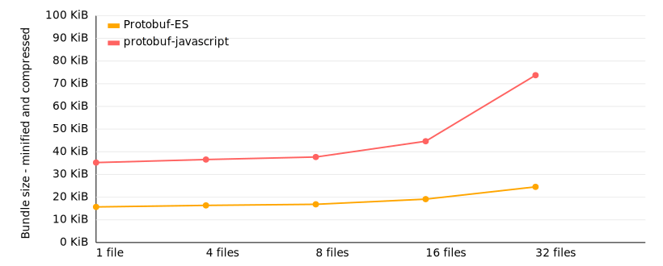

# Code size comparison

This is a simple code size comparison between Protobuf-ES and google-protobuf.

We are generating code for the module [buf.build/bufbuild/buf](https://buf.build/bufbuild/buf)
once with `protoc-gen-js` from [github.com/protocolbuffers/protobuf-javascript](https://github.com/protocolbuffers/protobuf-javascript),
once with `protoc-gen-es` from Protobuf-ES. Then we bundle a [snippet of code that imports from one generated file](./src/gen/protobuf-es/entry-1.ts)
with [esbuild](https://esbuild.github.io/), minify the bundle, and compress it like a web server would
usually do. We repeat this for an increasing number of files.

Tabular data

<!-- TABLE-START -->

| code generator      | files | bundle size |  minified | compressed |
| ------------------- | ----: | ----------: | --------: | ---------: |
| Protobuf-ES         |     1 |   133,674 b |  69,054 b |   15,873 b |
| Protobuf-ES         |     4 |   135,863 b |  70,561 b |   16,573 b |
| Protobuf-ES         |     8 |   138,625 b |  72,332 b |   17,082 b |
| Protobuf-ES         |    16 |   149,075 b |  80,313 b |   19,393 b |
| Protobuf-ES         |    32 |   176,866 b | 102,331 b |   24,873 b |
| protobuf-javascript |     1 |   314,120 b | 244,024 b |   35,999 b |
| protobuf-javascript |     4 |   340,137 b | 258,996 b |   37,473 b |
| protobuf-javascript |     8 |   360,931 b | 270,573 b |   38,585 b |
| protobuf-javascript |    16 |   518,906 b | 363,964 b |   45,793 b |
| protobuf-javascript |    32 | 1,286,214 b | 854,395 b |   75,520 b |

<!-- TABLE-END -->

