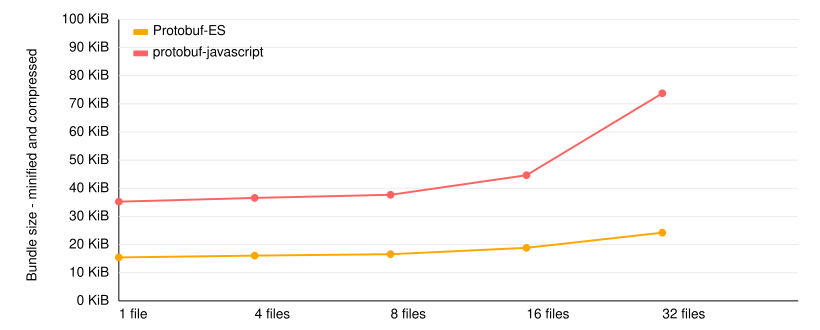

# Code size comparison

This is a simple code size comparison between Protobuf-ES and google-protobuf.

We are generating code for the module [buf.build/bufbuild/buf](https://buf.build/bufbuild/buf)
once with `protoc-gen-js` from [github.com/protocolbuffers/protobuf-javascript](https://github.com/protocolbuffers/protobuf-javascript),
once with `protoc-gen-es` from Protobuf-ES. Then we bundle a [snippet of code that imports from one generated file](./src/gen/protobuf-es/entry-1.ts)
with [esbuild](https://esbuild.github.io/), minify the bundle, and compress it like a web server would
usually do. We repeat this for an increasing number of files.

Tabular data

<!-- TABLE-START -->

| code generator      | files | bundle size |  minified | compressed |
| ------------------- | ----: | ----------: | --------: | ---------: |
<<<<<<< HEAD
| Protobuf-ES         |     1 |   136,538 b |  70,319 b |   16,283 b |
| Protobuf-ES         |     4 |   138,727 b |  71,827 b |   16,971 b |
| Protobuf-ES         |     8 |   141,489 b |  73,598 b |   17,465 b |
| Protobuf-ES         |    16 |   151,939 b |  81,579 b |   19,831 b |
| Protobuf-ES         |    32 |   179,730 b | 103,597 b |   25,303 b |
||||||| 43676bc8
| Protobuf-ES         |     1 |   136,544 b |  70,588 b |   16,261 b |
| Protobuf-ES         |     4 |   138,733 b |  72,096 b |   16,911 b |
| Protobuf-ES         |     8 |   141,495 b |  73,867 b |   17,457 b |
| Protobuf-ES         |    16 |   151,945 b |  81,848 b |   19,794 b |
| Protobuf-ES         |    32 |   179,736 b | 103,866 b |   25,299 b |
=======
| Protobuf-ES         |     1 |   136,676 b |  70,698 b |   16,233 b |
| Protobuf-ES         |     4 |   138,865 b |  72,206 b |   16,952 b |
| Protobuf-ES         |     8 |   141,627 b |  73,977 b |   17,427 b |
| Protobuf-ES         |    16 |   152,077 b |  81,958 b |   19,813 b |
| Protobuf-ES         |    32 |   179,868 b | 103,976 b |   25,221 b |
>>>>>>> main
| protobuf-javascript |     1 |   314,172 b | 244,057 b |   36,091 b |
| protobuf-javascript |     4 |   340,189 b | 259,029 b |   37,458 b |
| protobuf-javascript |     8 |   360,983 b | 270,606 b |   38,596 b |
| protobuf-javascript |    16 |   518,958 b | 363,997 b |   45,717 b |
| protobuf-javascript |    32 | 1,286,266 b | 854,428 b |   75,520 b |

<!-- TABLE-END -->

