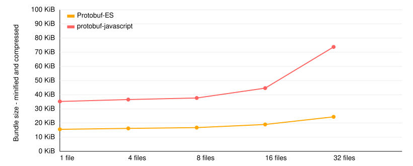

# Code size comparison

This is a simple code size comparison between Protobuf-ES and google-protobuf.

We are generating code for the module [buf.build/bufbuild/buf](https://buf.build/bufbuild/buf)
once with `protoc-gen-js` from [github.com/protocolbuffers/protobuf-javascript](https://github.com/protocolbuffers/protobuf-javascript),
once with `protoc-gen-es` from Protobuf-ES. Then we bundle a [snippet of code that imports from one generated file](./src/gen/protobuf-es/entry-1.ts)
with [esbuild](https://esbuild.github.io/), minify the bundle, and compress it like a web server would
usually do. We repeat this for an increasing number of files.

Tabular data

<!-- TABLE-START -->

| code generator      | files | bundle size |  minified | compressed |
| ------------------- | ----: | ----------: | --------: | ---------: |
| Protobuf-ES         |     1 |   135,923 b |  67,521 b |   15,908 b |
| Protobuf-ES         |     4 |   138,112 b |  69,026 b |   16,560 b |
| Protobuf-ES         |     8 |   140,870 b |  70,797 b |   17,085 b |
| Protobuf-ES         |    16 |   151,304 b |  78,778 b |   19,392 b |
| Protobuf-ES         |    32 |   179,091 b | 100,802 b |   24,963 b |
| protobuf-javascript |     1 |   314,172 b | 244,057 b |   36,091 b |
| protobuf-javascript |     4 |   340,189 b | 259,029 b |   37,458 b |
| protobuf-javascript |     8 |   360,983 b | 270,606 b |   38,596 b |
| protobuf-javascript |    16 |   518,958 b | 363,997 b |   45,717 b |
| protobuf-javascript |    32 | 1,286,266 b | 854,428 b |   75,520 b |

<!-- TABLE-END -->

