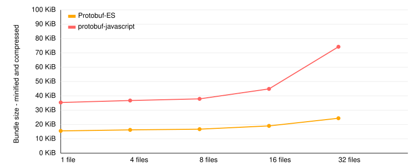

# Code size comparison

This is a simple code size comparison between Protobuf-ES and google-protobuf.

We are generating code for the module [buf.build/bufbuild/buf](https://buf.build/bufbuild/buf)
once with `protoc-gen-js` from [github.com/protocolbuffers/protobuf-javascript](https://github.com/protocolbuffers/protobuf-javascript),
once with `protoc-gen-es` from Protobuf-ES. Then we bundle a [snippet of code that imports from one generated file](./src/gen/protobuf-es/entry-1.ts)
with [esbuild](https://esbuild.github.io/), minify the bundle, and compress it like a web server would
usually do. We repeat this for an increasing number of files.

Tabular data

<!-- TABLE-START -->

| code generator      | files | bundle size |  minified | compressed |
| ------------------- | ----: | ----------: | --------: | ---------: |
| Protobuf-ES         |     1 |   136,343 b |  67,792 b |   15,926 b |
| Protobuf-ES         |     4 |   138,532 b |  69,296 b |   16,641 b |
| Protobuf-ES         |     8 |   141,290 b |  71,067 b |   17,155 b |
| Protobuf-ES         |    16 |   151,724 b |  79,050 b |   19,498 b |
| Protobuf-ES         |    32 |   179,511 b | 101,073 b |   24,962 b |
| protobuf-javascript |     1 |   316,830 b | 245,787 b |   36,229 b |
| protobuf-javascript |     4 |   342,847 b | 260,759 b |   37,626 b |
| protobuf-javascript |     8 |   363,641 b | 272,336 b |   38,816 b |
| protobuf-javascript |    16 |   521,616 b | 365,727 b |   45,934 b |
| protobuf-javascript |    32 | 1,293,833 b | 859,254 b |   76,040 b |

<!-- TABLE-END -->

