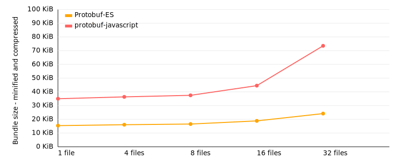

# Code size comparison

This is a simple code size comparison between protobuf-es and google-protobuf.

We are generating code for the module [buf.build/bufbuild/buf](https://buf.build/bufbuild/buf)
once with `protoc-gen-js` from [github.com/protocolbuffers/protobuf-javascript](https://github.com/protocolbuffers/protobuf-javascript), 
once with `protoc-gen-es` from Protobuf-ES. Then we bundle a [snippet of code that imports from one generated file](./src/gen/protobuf-es/entry-1.ts) 
with [esbuild](https://esbuild.github.io/), minify the bundle, and compress it like a web server would 
usually do. We repeat this for an increasing number of files.

Tabular data

<!--- TABLE-START -->
| code generator  | files    | bundle size             | minified               | compressed         |
|-----------------|----------|------------------------:|-----------------------:|-------------------:|
| protobuf-es | 1 | 124,016 b | 64,256 b | 15,007 b |
| protobuf-es | 4 | 126,211 b | 65,762 b | 15,654 b |
| protobuf-es | 8 | 128,989 b | 67,533 b | 16,171 b |
| protobuf-es | 16 | 139,497 b | 75,514 b | 18,520 b |
| protobuf-es | 32 | 167,392 b | 97,539 b | 23,910 b |
| protobuf-javascript | 1 | 339,613 b | 255,820 b | 42,481 b |
| protobuf-javascript | 4 | 366,281 b | 271,092 b | 43,912 b |
| protobuf-javascript | 8 | 388,324 b | 283,409 b | 45,038 b |
| protobuf-javascript | 16 | 548,365 b | 378,100 b | 52,204 b |
| protobuf-javascript | 32 | 1,240,889 b | 819,610 b | 78,780 b |
<!--- TABLE-END -->

